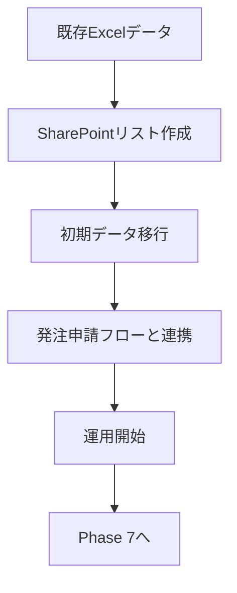
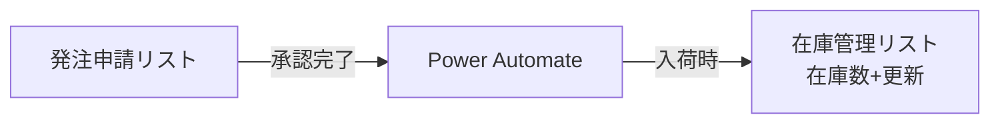

# Phase 6: 在庫管理リスト計画書

**最終更新**: 2026年1月30日  
**ステータス**: ✅ Phase 6完了

### 完了条件（2026/01/30確定）
| # | 条件 | 状態 | 備考 |
|---|------|------|------|
| 1 | SharePointリスト「在庫管理」作成 | ✅完了 | 2026/01/23 |
| 2 | 必須列・選択肢の設定完了 | ✅完了 | 2026/01/23 |
| 3 | サンプルデータ投入（動作確認用） | ✅完了 | 13件投入済み |
| 4 | 発注申請リストとの連携テスト | ✅完了 | 発注ID紐付け確認済み |
| 5 | ビュー設定ガイド作成 | ✅完了 | - |

> [!NOTE]
> 本番データ移行はPhase 7完了後に実施予定。現在はサンプルデータで運用中。

---

## 概要

| 項目 | 内容 |
|-----|------|
| 目的 | 在庫状況のリアルタイム共有・発注申請との連携 |
| 対象シート | 在庫（33行×74列） |
| 優先度 | 🔴 最優先 |

---

## フロー全体像

---

## 実装ステップ

### Step 1: SharePointリスト作成

**リスト名**: `在庫管理`

| 列名 | 内部名 | 型 | 必須 | 説明 |
|-----|--------|-----|-----|------|
| 品名 | Title | 1行テキスト | ○ | 試薬・資材名 |
| メーカー | Maker | 1行テキスト | ○ | 製造元 |
| メーカーコード | MakerCode | 1行テキスト | ○ | 製品番号 |
| 数量単位 | QuantityUnit | 選択肢 | ○ | **New** 個, 本, 箱, mL, g, セット, シート, その他 |
| 枝番 | BranchNumber | 1行テキスト | ○ | **必須** (既定値: "00") ロット違い管理用 |
| 包装形状 | PackageType | 1行テキスト | - | 梱包形態 |
| 入数/箱 | UnitsPerBox | 数値 | - | 1箱あたり個数 |
| 発注業者 | Vendor | 1行テキスト | - | 発注リストと連携 |
| 発注ID | SourceOrderID | 1行テキスト | - | 連携キー (YYDD-000-PJ) |
| 単価 | UnitPrice | 通貨 | - | 発注リストと連携 ※計算用のため実数値として保持 |
| 現在在庫数 | CurrentStock | 数値 | ○ | 現時点の在庫 |
| 在庫金額 | InventoryValue | 計算値 | - | 単価 × 在庫数 |
| 発注者 | Orderer | ユーザー | - | 発注リストと連携 |

| 保管場所 | StorageLocation | 選択肢（複数選択可） | - | 204, 101, 未来, 7F, 動物舎 ※セット品で場所が分かれる場合に対応 |
| 保管温度 | StorageTemperature | 選択肢（複数選択可） | - | 常温, 4℃, -30℃, -80℃ ※「常温＋冷凍」などの組み合わせに対応 |
| 使用期限 | ExpiryDate | 日付 | - | 有効期限 |
| バーコード | Barcode | 1行テキスト | - | 将来用 |
| ロット番号 | LotNumber | 1行テキスト | - | 最新または管理対象のロット |
| 納品日 | DeliveryDate | 日付 | - | 物品が届いた日（受入検査日とは別） |
| 受入検査日 | InspectionDate | 日付 | - | 検品を行った日 |
| COA入手日 | COA_Date | 日付 | - | 成績書入手日 |
| 備考 | Notes | 複数行テキスト | - | メモ |

---

### Step 2: 初期データ移行

#### 採用方針：A案（Excelからの直接インポート）

> [!IMPORTANT]
> **採用決定**: 2026/01/23にA案（Excel直接インポート）を採用。  
> **理由**: 件数が少なく（～100件程度）、Power Automateの複雑さに対するメリットがないため。

#### 移行手順
| # | タスク | 方法 | 状態 |
|---|-------|------|------|
| 1 | Excelで移行対象データ抽出 | 不要列削除、整形 | サンプル13件完了 |
| 2 | SharePointへインポート | Excel直接インポート | サンプル13件完了 |
| 3 | データ確認・修正 | 目視確認 | サンプル確認済み |

#### 本番移行チェックリスト（Phase 7完了後に実施）
- [ ] 既存Excelシートから全データをエクスポート
- [ ] 列名をSharePointリスト形式にマッピング
- [ ] インポート前に重複チェック（品名+枝番の組合せ）
- [ ] SharePointにインポート
- [ ] 件数一致確認
- [ ] ソート・フィルター動作確認

#### 再取り込み手順（エラー発生時）
1. 問題のあるアイテムを削除
2. Excelで修正
3. 該当行のみ再インポート

---

### Step 3: 発注申請フローとの連携

**連携オプション**:
| オプション | 内容 | 決定 |
|-----------|------|------|
| A. 手動更新 | 入荷時に手動で在庫数を更新 | ✅ **採用** |
| B. 自動更新 | Power Automateで自動更新 | 将来検討 |

> [!IMPORTANT]
> **運用方針決定**: 2026/01/30にユーザー合意済み。  
> - 手動更新を採用（グリッドビュー活用で手数削減）
> - 自動更新はPhase 7運用安定後に再評価

---

### Step 4: 動作確認

| # | 確認項目 |
|---|---------|
| 1 | リスト表示・編集が正常にできるか |
| 2 | フィルター・ソートが使えるか |
| 3 | 発注申請リストと整合性があるか |
| 4 | 「手数は少なく」を実現できているか（グリッドビュー活用等） |

---

## 実装前の準備作業

- [x] 保管場所の選択肢を決定 → 204, 101, 未来, 7F, 動物舎
- [x] 保管温度の選択肢を決定 → 常温, 4℃, -30℃, -80℃
- [x] Excelから移行対象データを特定（2026/01/23：サンプル13件で確認完了、本番は後続フェーズで実施）
- [x] 既存の「在庫」シートの列名を確認（2026/01/23：Step 1 列定義に反映済み）
- [ ] 既存データ（サンプル13件）の「枝番」に "00" を一括設定（本番移行前）

---

## セット品の対応案

セット品（キットなど）の管理方法として、以下の2パターンを提案します。

| パターン | 内容 | メリット | デメリット |
|---|---|---|---|
| **A. 親品目管理（推奨）** | キット全体を「1つ」として登録し、保管場所・温度を複数選択 | 管理がシンプル。 例：温度「常温」「-30℃」、場所「常温棚」「冷凍庫」を両方選択 | 構成品の個別在庫は見えない |
| **B. 構成品展開** | キットとしての登録はせず、構成品（Bottle A, B...）を個別に登録 | 正確な在庫把握 | 登録・更新の手間が倍増 |

**推奨案（A）の運用イメージ**:
- 品名：「〇〇抽出キット」
- 在庫数：キットの箱数で管理
- 備考欄に「構成品：Buffer A, Buffer B...」と記載しておく

### ロット管理・日付管理の方針

現状の運用（枝番管理）に合わせて、**「1ロット＝1行」** とします。

- 同一商品でも、ロットが変われば**行を追加**します。
- 区別するために「枝番」列（-01, -02など）または「ロット番号」を使用します。
- これにより、「古いロットの在庫」と「新しいロットの在庫」を正確に分けて管理可能です。

---

### データ品質ルール（2026/01/30追加）

#### ユニークキー設計
| キー構成 | 目的 | 実装方法 |
|---------|------|----------|
| 品名 + 枝番 | 同一品目のロット違いを一意に識別 | 入力時に重複チェック（手動確認） |
| メーカーコード | 発注・参照の正確性確保 | 必須列として設定済み |

> [!WARNING]
> SharePointリストでは複合ユニーク制約が設定できないため、重複登録は手動で防止する必要があります。新規登録時は必ず「品名+枝番」で既存確認を行ってください。

#### 入力制約・バリデーション
| 列名 | 制約 | 備考 |
|------|------|------|
| 現在在庫数 | 0以上（負の値禁止） | Power Apps側でバリデーション予定 |
| 品名 | 必須 | 列設定で必須化済み |
| メーカー | 必須 | 列設定で必須化済み |
| メーカーコード | 必須 | 列設定で必須化済み |
| 枝番 | **必須** | **既定値 "00"** を設定。空データ許容しない |
| 数量単位 | **必須** | 選択肢から選択 (Phase 7連携のキー情報) |

#### 重複防止策
- **登録前確認**: 新規登録時に「品名」でフィルターし、同一品目がないか確認
- **枝番運用**: 同一品目の追加時は必ず枝番（-1, -2等）を付与（初期値は00だが、実運用では意味のある枝番へ変更推奨）
- **将来検討**: Power Automateによる自動重複チェック

---

## ユーザー確認事項（解決済み）

| # | 質問 | 回答 | 確定日 |
|---|------|------|--------|
| 1 | 保管場所の選択肢は？ | 204, 101, 未来, 7F, 動物舎 | 2026/01/23 |
| 2 | 手動更新から始めてよいか？ | ✅ 合意済み（手動更新で開始） | 2026/01/30 |

---

### 在庫金額の集計について

SharePointリスト上で管理することをお勧めします。
「単価」と「在庫金額（計算列）」を追加することで、**リスト上で常に最新の在庫総額を確認**できるようになります。

- **単価列**: 追加します。
- **在庫金額列**: `=[単価] * [現在在庫数]` の計算式を設定します。
- **集計**: リストビューの集計機能で、合計金額を常に表示させます。

### 発注リストとの連携について

**連携キーは「発注ID（YYDD-000-PJ）」を使用します。**
品名だと「同じ商品を別の日にもう一度買った」場合に区別がつかなくなりますが、発注IDであれば一意に特定できるためです。

- **新規項目の追加**: 「発注ID」列を追加しました。
- **運用の流れ**: 在庫登録時に、元となった発注の発注IDを入力（コピー）することで、後から「いつ、どの発注で買ったものか」を確実に追跡できます。

---

## 完了実績と次のアクション

### ✅ 完了実績
| 日付 | 内容 |
|------|------|
| 2026/01/23 | SharePointリスト「在庫管理」作成完了 |
| 2026/01/23 | サンプルデータ13件投入（DMEM培地、FBS等） |
| 2026/01/23 | ビュー設定ガイド作成 |
| 2026/01/23 | 発注申請リストとの連携テスト合格（発注ID紐付け確認済み） |
| 2026/01/30 | 手動更新運用方針の最終合意 |
| 2026/01/30 | データ品質ルール（ユニークキー・入力制約）追記 |

### 📋 残タスク（Phase 7完了後に実施）
- [ ] 既存Excelからの本番データ全件移行
- [ ] 移行後の件数・内容検証

### 🚀 次のフェーズ
- [Phase 7: 受入・出庫記録リスト](../Phase7_受入出庫記録/Phase7_受入出庫記録計画書.md)

