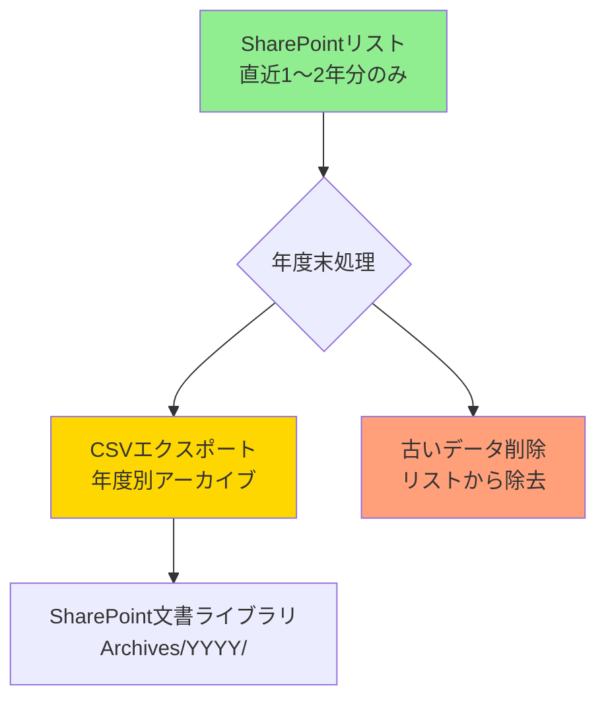
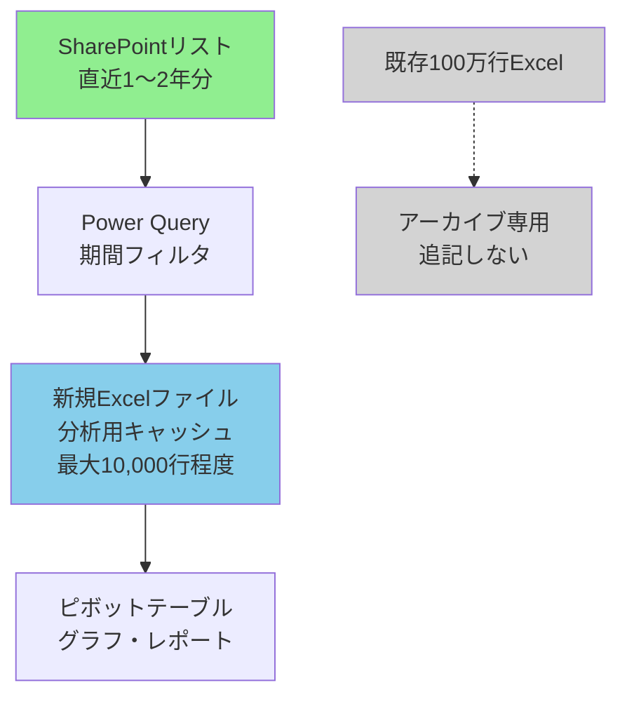
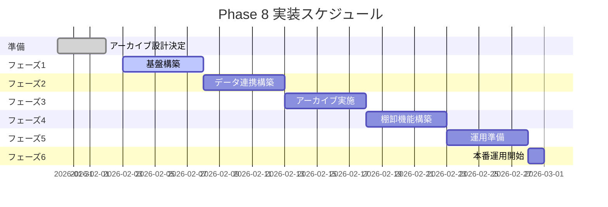

# Phase 8: 大量データ連携計画書（改訂版）

**最終更新**: 2026年1月30日（第4回改訂）  
**ステータス**: 📋 第4回レビュー指摘対応完了  
**前回更新**: 2026年1月30日（第3回改訂）

---

## 改訂履歴

| 日付 | 版 | 変更内容 |
|------|---|----------|
| 2026-01-30 | v4 | 第4回指摘対応:100万行Excel分割手順を全面改訂（SharePointリスト経由→Excel直接分割方式） |
| 2026-01-30 | v3 | 第3回指摘対応:PoCセクション統合、リスク表統合、100万行Excel分割手順追加、Gantt依存関係明記 |
| 2026-01-30 | v2 | 第2回指摘対応:オプション評価軸表追加、Power Query/Automate要件明確化、オプションC対策、実装ステップ拡充 |
| 2026-01-30 | v1 | 第1回指摘対応:行上限対策、SharePoint設計詳細、アーカイブ方針、棚卸突合計画を追加 |
| 2026-01-21 | v0 | 初版作成 |

---

## 概要

| 項目 | 内容 |
|-----|------|
| 目的 | 大量の履歴データを適切に管理し、分析・レポート作成に活用 |
| 対象データ | 移動入力データ、出庫記録入力データ |
| 優先度 | 🟡 中（Phase 7完了後、データ増加前に対策必須） |

---

## 前提条件（ユーザー確認済み）

| 項目 | 内容 |
|-----|------|
| データ増加ペース | 週10〜20行（月40〜80行、年間約500〜1,000行） |
| 保持期間 | 現状約5年分／正式ポリシー未決定 |
| 利用可能ストア | SharePointリストのみ（Dataverse/SQL Server不可） |

---

## 対象データの現状分析

| シート名 | 行数 | 列数 | 問題点 | 重大度 |
|---------|------|------|--------|--------|
| 移動入力データ | 6,934 | 9 | 大量履歴データ | 🟡 中 |
| 出庫記録入力データ | **1,048,576** | 14 | **Excel最大行数到達** | 🔴 高 |

> [!CAUTION]
> **出庫記録入力データは既にExcel最大行数（1,048,576行）に到達しており、これ以上の追記は不可能です。**  
> 既存ファイルは**「アーカイブ専用」として固定**し、新規データの追記は行いません。  
> 分析用には**軽量な新規Excelファイル（最大10,000行程度）を別途作成**します。

> [!WARNING]
> SharePointリストには5,000件のビューしきい値制限があります。適切なインデックス設計とフィルタビューなしでは、大量データ取得時にタイムアウトが発生します。

### 既存Excelファイルの取り扱い

| ファイル | 役割 | 運用方針 |
|---------|------|----------|
| 既存100万行Excel | アーカイブ専用 | 追記禁止、参照のみ、将来的にCSV分割を検討 |
| 新規分析用Excel | 分析・レポート作成 | Power Queryで直近1年分のみ取得、週1回更新 |

---

## データ保持・アーカイブ方針

### 基本方針



### 詳細設計

| 項目 | 内容 |
|-----|------|
| **アクティブデータ** | SharePointリストに直近1〜2年分のみ保持 |
| **アーカイブ粒度** | 年度別（4月〜3月）でCSVファイル化 |
| **アーカイブ先** | SharePoint文書ライブラリ `01_Documents/Archives/YYYY/` |
| **ファイル命名規則** | `出庫記録_YYYY年度.csv`, `移動記録_YYYY年度.csv` |
| **削除タイミング** | 年度末（3月末）に2年以上前のデータを削除 |
| **バックアップ** | アーカイブCSVをローカル/OneDriveにも保存 |

### アーカイブ実行手順

| # | タスク | 担当 | 実行時期 | 手段 |
|---|--------|------|----------|------|
| 1 | 対象年度データのエクスポート | 管理者 | 毎年3月末 | SharePointリスト → CSVエクスポート |
| 2 | ファイル命名・保存 | 管理者 | 同上 | `出庫記録_YYYY年度.csv` として保存 |
| 3 | アーカイブフォルダへアップロード | 管理者 | 同上 | `01_Documents/Archives/YYYY/` へ配置 |
| 4 | ローカルバックアップ | 管理者 | 同上 | OneDrive/外部HDDへコピー |
| 5 | SharePointリストから削除 | 管理者 | 確認後 | 一括削除（ビューフィルタ使用） |
| 6 | 削除確認 | 管理者 | 同上 | 件数確認、動作テスト |

---

## SharePointリスト設計（5,000件しきい値対策）

### インデックス設計

> [!IMPORTANT]
> SharePointリストは5,000件を超えるビューでタイムアウトが発生します。以下のインデックス設計が必須です。

| リスト名 | インデックス列1 | インデックス列2 | インデックス列3 |
|---------|----------------|----------------|----------------|
| 出庫記録 | 出庫日（降順） | 在庫品目 (Lookup) | - |
| 移動記録 | 移動日（降順） | 品目ID | - |

### フィルタビュー設計

| ビュー名 | フィルタ条件 | 想定件数 | 用途 |
|---------|-------------|----------|------|
| 直近1ヶ月 | 出庫日 >= [今日]-30日 | 〜200件 | 日常確認 |
| 直近3ヶ月 | 出庫日 >= [今日]-90日 | 〜500件 | 月次レポート |
| 直近1年 | 出庫日 >= [今日]-365日 | 〜2,000件 | 年次分析 |
| 当年度 | 出庫日 >= 4/1 AND 出庫日 <= 3/31 | 〜1,000件 | 年度集計 |
| 全データ（管理者のみ） | なし | 要注意 | エクスポート専用 |

### リスト設定手順

1. **インデックス作成**
   - リスト設定 → インデックス付き列 → 新しいインデックス
   - 「出庫日」列を選択（降順）
   - 「在庫品目 (InventoryItem)」列を選択（Lookup参照）

2. **ビュー作成**
   - 各フィルタビューを上記仕様で作成
   - デフォルトビューは「直近1ヶ月」に設定

3. **アクセス権限**
   - 「全データ」ビューは管理者のみ閲覧可能に設定

---

## 連携方式の比較・評価

> [!IMPORTANT]
> 以下の評価軸に基づき、**オプションA（Power Query連携）を推奨**します。

### 評価軸表

| 評価軸 | オプションA<br/>Power Query連携 | オプションB<br/>Power Automate連携 | オプションC<br/>Excel維持・分散管理 |
|--------|--------------------------------|-----------------------------------|-----------------------------------|
| **データ量対応** | ⭕ 優秀<br/>期間フィルタで5,000件以下に制限可能 | ⚠️ 制約あり<br/>大容量Excel更新不可、小容量のみ | ⭕ 良好<br/>過去データはそのまま保持 |
| **処理時間** | ⭕ 高速<br/>30秒〜2分（直近1年分） | ❌ 遅い<br/>10,000行で5〜10分、タイムアウトリスク | ⭕ 即時<br/>既存ファイル参照のみ |
| **リカバリ容易性** | ⭕ 容易<br/>更新ボタン1つで再取得 | ⚠️ 中程度<br/>フロー再実行が必要、失敗時の手動対応 | ❌ 困難<br/>データ分散、どこに何があるか不明確 |
| **運用負荷** | ⭕ 低<br/>週1回手動更新（1分） | ⭕ 低<br/>完全自動（ただし監視必要） | ❌ 高<br/>検索・メタデータ管理が煩雑 |
| **技術的実現性** | ⭕ 確実<br/>標準機能、実績多数 | ⚠️ 制約あり<br/>Excel Online制限、大容量不可 | ⭕ 確実<br/>現状維持 |
| **データ一元性** | ⭕ 優秀<br/>SharePointが単一ソース | ⭕ 優秀<br/>SharePointが単一ソース | ❌ 不良<br/>データ分散、整合性リスク |
| **拡張性** | ⭕ 高<br/>フィルタ条件変更容易 | ⚠️ 中<br/>フロー修正が必要 | ❌ 低<br/>ファイル増加で管理困難 |
| **初期設定コスト** | ⭕ 低<br/>30分程度 | ⚠️ 高<br/>2〜3時間、テスト必要 | ⭕ 低<br/>設定不要 |
| **保守性** | ⭕ 高<br/>設定がExcel内で完結 | ⚠️ 中<br/>Power Automate知識必要 | ❌ 低<br/>属人化リスク |
| **総合評価** | **🥇 推奨** | 🥈 限定的使用 | 🥉 非推奨 |

### 推奨理由（オプションA）

1. **5,000件しきい値対応**: 期間フィルタ（直近1年分）で常に5,000件以下を取得可能
2. **処理時間**: 30秒〜2分で完了、タイムアウトリスクが低い
3. **リカバリ容易**: 更新ボタン1つで再取得、失敗時の対応が簡単
4. **データ一元性**: SharePointリストが単一ソース、整合性が保証される
5. **技術的確実性**: 標準機能、実績多数、特殊な権限不要

### オプションBの限定的使用

Power Automateは以下の用途に限定して使用します:

| 用途 | 理由 |
|------|------|
| 小容量キャッシュ更新（最大10,000行） | Excel Online制限内で実現可能 |
| CSVアーカイブ自動化（年1回） | 大容量でもCSVエクスポートは可能 |
| 通知のみ（5,000件超警告） | データ更新なし、通知のみなら安全 |

**使用不可**: 既存100万行Excelへの追記（技術的に不可能）

### オプションCの課題と対策

オプションC（データ分散管理）を選択する場合、以下の対策が必須です:

| 課題 | 対策 |
|------|------|
| **検索困難** | メタデータ管理表を作成（ファイル名、期間、保存場所の一覧） |
| **整合性リスク** | 定期的な突合チェック（月1回） |
| **属人化** | 運用マニュアル整備、ファイル命名規則の徹底 |
| **バージョン管理** | SharePoint文書ライブラリのバージョン履歴機能を活用 |

**メタデータ管理表の例**:

| ファイル名 | 対象期間 | 保存場所 | 最終更新日 | 担当者 |
|-----------|---------|---------|-----------|--------|
| 出庫記録_2021-2023.xlsx | 2021/4〜2023/3 | 01_Documents/Archives/2021-2023/ | 2023-03-31 | 管理者A |
| 出庫記録_2023-2025.xlsx | 2023/4〜2025/3 | 01_Documents/Archives/2023-2025/ | 2025-03-31 | 管理者B |
| 出庫記録_現行.xlsx | 2025/4〜現在 | 01_Documents/Current/ | 随時 | 全員 |

> [!WARNING]
> オプションCは**データ分散による検索・管理コストが高く、非推奨**です。  
> やむを得ず選択する場合は、上記の対策を必ず実施してください。

---

## データ連携方式（改訂版）

### 採用方式: オプションA（Power Query連携）

> [!TIP]
> Power Query連携を採用し、**小容量の分析用キャッシュExcelファイルを新規作成**します。  
> 既存の100万行ブックは「アーカイブ専用」として固定し、追記しません。



### 設定詳細

| 項目 | 内容 |
|-----|------|
| **データソース** | SharePointリスト（**インデックス済みビュー使用必須**） |
| **取得方法** | Power Query（Excel → データ → データの取得 → SharePointリストから） |
| **フィルタ条件（必須）** | 出庫日 >= [今日]-365日（直近1年分のみ）<br/>**常に5,000件以下を保証** |
| **更新頻度** | 手動更新（週1回、レポート作成時） |
| **ファイルサイズ** | 最大10,000行程度（約5MB以下） |
| **保存場所** | SharePoint文書ライブラリ `01_Documents/Reports/` |

> [!IMPORTANT]
> **5,000件しきい値対応（必須要件）**
> 
> Power Queryで取得するデータは**常に5,000件以下**である必要があります。以下を遵守してください:
> 
> 1. **期間フィルタ必須**: `出庫日 >= Date.AddDays(DateTime.LocalNow(), -365)` を必ず設定
> 2. **インデックス済みビュー使用**: SharePointリストの「出庫日」列にインデックスが必須
> 3. **取得件数監視**: 初回設定時に取得件数を確認（5,000件超の場合は期間を短縮）
> 4. **定期確認**: 月1回、取得件数を確認し、4,500件超なら期間を調整

### インクリメンタル更新手順

1. **初回設定**
   - 新規Excelファイル作成: `出庫記録_分析用.xlsx`
   - Power Query接続設定
     1. データタブ → データの取得 → SharePointリストから
     2. サイトURL入力: `https://[your-site].sharepoint.com/sites/[site-name]`
     3. リスト選択: 「出庫記録」
     4. **ビュー選択**: 「直近1年」（インデックス済みビュー）
   - フィルタ条件設定（Power Queryエディタ）:
     ```m
     = Table.SelectRows(Source, each [出庫日] >= Date.AddDays(DateTime.LocalNow(), -365))
     ```
   - **取得件数確認**: 5,000件以下であることを確認
   - 読み込み先: 既存のワークシート

2. **定期更新（週1回）**
   - Excelファイルを開く
   - データタブ → すべて更新
   - 更新完了を確認（所要時間: 約30秒〜2分）
   - **件数確認**: 取得行数が5,000件以下であることを確認

3. **トラブルシューティング**

| 問題 | 原因 | 対策 |
|------|------|------|
| タイムアウト発生 | 5,000件超のデータ取得 | フィルタ期間を短縮（365日→180日） |
| データ欠損 | インデックス未設定 | SharePointリストのインデックス再構築 |
| 更新が遅い（5分以上） | ビューフィルタ未使用 | インデックス済みビュー「直近1年」を使用 |
| 接続エラー | 権限不足 | SharePointリストへの読み取り権限を確認 |
| 重複データ | キャッシュ問題 | Power Queryキャッシュをクリア |

---

## Power Automate自動化方針（限定的使用）

> [!WARNING]
> Excel Onlineコネクタは大容量ブック（100万行）への更新が不可能です。  
> 自動化は以下の用途に限定します。

### 自動化対象（実装可能）

| # | 用途 | トリガー | アクション | 制約 |
|---|------|----------|-----------|------|
| 1 | 小容量キャッシュへの部分更新 | 毎週月曜9時 | SharePointリスト → 分析用Excel（直近1年分のみ） | 最大10,000行 |
| 2 | CSVアーカイブ自動化 | 毎年3月31日 | SharePointリスト → CSVエクスポート → Archivesフォルダ | 年1回実行 |
| 3 | 通知のみ | リスト件数5,000件超 | 管理者へメール通知（アーカイブ促進） | - |

### 自動化対象外（非推奨）

- ❌ 既存100万行Excelへの追記（技術的に不可能）
- ❌ リアルタイム同期（タイムアウトリスク）
- ❌ 全データの毎日更新（不要＋負荷大）

### 実装例: 小容量キャッシュ更新フロー（エラーハンドリング付き）

```
トリガー: スケジュール実行（毎週月曜9:00）
↓
【スコープ: メイン処理】
  アクション1: SharePointリストから項目を取得
    - リスト: 出庫記録
    - フィルタ: 出庫日 ge '@{addDays(utcNow(), -365)}'
    - 上限: 10,000件
    - タイムアウト: 5分
  ↓
  アクション2: 条件分岐（件数チェック）
    - 条件: @{length(outputs('アクション1')?['body/value'])} <= 10000
    - はいの場合 → アクション3へ
    - いいえの場合 → エラー処理へ
  ↓
  アクション3: Excelファイルのテーブルをクリア
    - ファイル: 01_Documents/Reports/出庫記録_分析用.xlsx
    - テーブル: Table1
  ↓
  アクション4: Excelテーブルに行を追加（Apply to each）
    - 各アイテムをテーブルに挿入
    - バッチサイズ: 100行ずつ
↓
【スコープ: エラーハンドリング】
  条件: @{result('スコープ: メイン処理')[0]['status']} equals 'Failed'
  ↓
  はいの場合:
    アクション5: 変数を初期化（リトライカウンタ）
      - 名前: retryCount
      - 型: 整数
      - 値: 0
    ↓
    アクション6: Do Until（最大3回リトライ）
      - 条件: @{variables('retryCount')} >= 3 OR @{result('スコープ: メイン処理')[0]['status']} equals 'Succeeded'
      ↓
      アクション7: 待機（指数バックオフ）
        - 間隔: @{mul(variables('retryCount'), 5)} 分
      ↓
      アクション8: スコープ: メイン処理を再実行
      ↓
      アクション9: retryCountをインクリメント
    ↓
    アクション10: 条件分岐（リトライ結果）
      - 条件: @{result('スコープ: メイン処理')[0]['status']} equals 'Failed'
      - はいの場合 → アクション11（失敗通知）
      - いいえの場合 → アクション12（成功通知）
↓
【通知】
  アクション11: 失敗通知メール送信
    - 宛先: 管理者メールアドレス
    - 件名: 【エラー】出庫記録分析用Excel更新失敗
    - 本文:
      ```
      出庫記録分析用Excelの自動更新が失敗しました。
      
      実行日時: @{utcNow()}
      エラー詳細: @{result('スコープ: メイン処理')[0]['error']['message']}
      リトライ回数: @{variables('retryCount')}
      
      対処方法:
      1. SharePointリストの接続を確認
      2. Excelファイルが他のユーザーに開かれていないか確認
      3. Power Automateフローを手動で再実行
      
      フローURL: [フローへのリンク]
      ```
  ↓
  アクション12: 成功通知メール送信（オプション）
    - 宛先: 管理者メールアドレス
    - 件名: 【完了】出庫記録分析用Excel更新成功
    - 本文:
      ```
      出庫記録分析用Excelの自動更新が完了しました。
      
      実行日時: @{utcNow()}
      更新行数: @{length(outputs('アクション1')?['body/value'])}
      リトライ回数: @{variables('retryCount')}
      
      ファイルパス: 01_Documents/Reports/出庫記録_分析用.xlsx
      ```
```

### エラーハンドリング設計

| エラー種類 | 検知方法 | リトライ | 通知 | 対処方法 |
|-----------|---------|---------|------|----------|
| **タイムアウト** | アクション1が5分超 | ⭕ 3回<br/>（5分、10分、15分後） | ✉️ 3回失敗後 | フィルタ期間を短縮 |
| **Excel更新失敗** | アクション3/4エラー | ⭕ 3回<br/>（5分、10分、15分後） | ✉️ 3回失敗後 | ファイルロック確認 |
| **件数超過** | 10,000件超 | ❌ なし | ✉️ 即時 | フィルタ期間を短縮 |
| **権限エラー** | 401/403エラー | ❌ なし | ✉️ 即時 | 権限設定確認 |
| **ネットワークエラー** | 接続失敗 | ⭕ 3回<br/>（5分、10分、15分後） | ✉️ 3回失敗後 | ネットワーク確認 |

### 監視・運用

| 項目 | 頻度 | 担当 | 確認内容 |
|------|------|------|----------|
| **フロー実行履歴確認** | 週1回 | 管理者 | 成功/失敗状況、実行時間 |
| **エラー通知対応** | 即時 | 管理者 | エラー原因調査、手動再実行 |
| **取得件数監視** | 月1回 | 管理者 | 10,000件に近づいていないか確認 |
| **パフォーマンス確認** | 月1回 | 管理者 | 実行時間が5分超えていないか |

---

## 棚卸突合計画

### 突合方式

| 項目 | 内容 |
|-----|------|
| **方式** | 半自動（Excelピボットテーブル使用） |
| **頻度** | 年2回（9月末、3月末） |
| **担当** | 在庫管理責任者 |
| **所要時間** | 約2〜3時間 |

### 実行手順

| # | タスク | 担当 | 実行時点 | 手段 | 成果物 |
|---|--------|------|----------|------|--------|
| 1 | 実地棚卸実施 | 全員 | 月末最終日17時 | バーコードスキャン or 手動カウント | 棚卸リスト（紙/Excel） |
| 2 | 棚卸データ入力 | 担当者 | 翌営業日午前 | SharePointリスト「棚卸記録」へ入力 | - |
| 3 | システム在庫スナップショット取得 | 管理者 | 月末最終日23:59 | SharePointリスト「在庫管理」をCSVエクスポート | `在庫スナップショット_YYYYMMDD.csv` |
| 4 | 突合Excel作成 | 管理者 | 翌営業日午後 | Power Query で棚卸記録とスナップショットを結合 | `棚卸突合_YYYYMMDD.xlsx` |
| 5 | 差異分析 | 管理者 | 同上 | ピボットテーブルで差異抽出 | 差異リスト |
| 6 | 差異原因調査 | 担当者 | 翌週内 | 現物確認、記録確認 | 調査報告書 |
| 7 | 在庫修正 | 管理者 | 確認後 | SharePointリスト「在庫管理」を手動修正 | - |
| 8 | 完了報告 | 管理者 | 同上 | 上長へ報告 | 棚卸完了報告書 |

### 突合ビュー設計

**SharePointリスト「棚卸記録」（新規作成）**

| 列名 | データ型 | 必須 | 説明 |
|------|---------|------|------|
| 棚卸日 | 日付 | ✓ | 実施日 |
| 品目ID | 参照（在庫管理） | ✓ | 品目へのリンク |
| 実地数量 | 数値 | ✓ | 実際にカウントした数量 |
| 担当者 | ユーザー | ✓ | カウント実施者 |
| 備考 | 複数行テキスト | - | 特記事項 |

**突合Excelテンプレート構成**

| シート名 | 内容 |
|---------|------|
| 突合結果 | Power Query結合結果（システム在庫 vs 実地数量） |
| 差異一覧 | 差異がある品目のみ抽出 |
| ピボット分析 | カテゴリ別・担当者別の差異集計 |

---

## 実装ステップ

### 準備フェーズ（Phase 7完了前）

| # | タスク | 担当 | 期限 | 前提条件 | 成果物 |
|---|--------|------|------|----------|--------|
| 0-1 | **アーカイブ設計決定** | 管理者 | Phase 7完了前 | - | アーカイブ方針決定書 |
| 0-2 | **保持期間・分割粒度の決定** | 管理者 | 同上 | - | データ保持ポリシー文書 |
| 0-3 | **アーカイブ先の決定** | 管理者 | 同上 | - | CSV/別リスト選択結果 |

**アーカイブ設計決定の詳細**:

| 決定事項 | 選択肢 | 推奨 | 理由 |
|---------|--------|------|------|
| **保持期間** | 1年 / 2年 / 3年 / 5年 | **2年** | 週10〜20行増加で年間500〜1,000行、2年で2,000行程度（5,000件以下） |
| **分割粒度** | 月別 / 四半期別 / 年度別 | **年度別** | 管理ファイル数が少なく、年度単位の分析に適している |
| **アーカイブ先** | CSV / 別SharePointリスト | **CSV** | 容量制限なし、Excel/Power BIで直接利用可能 |
| **アーカイブ場所** | SharePoint文書ライブラリ / OneDrive / 外部ストレージ | **SharePoint文書ライブラリ** | アクセス権限管理が容易、バージョン履歴あり |

### フェーズ1: 基盤構築（Phase 7完了後1週間）

| # | タスク | 担当 | 期限 | 前提条件 | 成果物 |
|---|--------|------|------|----------|--------|
| 1 | SharePointリストインデックス作成 | 管理者 | Phase 7完了後1週間 | Phase 7完了 | インデックス設定完了 |
| 2 | **参照ビュー作成（5種類）** | 管理者 | 同上 | #1完了 | 直近1ヶ月、3ヶ月、1年、当年度、全データビュー |
| 3 | アーカイブフォルダ構造作成 | 管理者 | 同上 | - | `01_Documents/Archives/YYYY/` |
| 4 | 棚卸記録リスト作成 | 管理者 | 同上 | #1完了 | SharePointリスト「棚卸記録」 |

**参照ビュー作成の詳細**:

各ビューには以下を設定:
- **フィルタ条件**: 日付範囲（5,000件以下を保証）
- **並び替え**: 出庫日（降順）
- **表示列**: 必要最小限（10列以内）
- **アクセス権限**: 「全データ」は管理者のみ

### フェーズ2: データ連携構築（1週間）

| # | タスク | 担当 | 期限 | 前提条件 | 成果物 |
|---|--------|------|------|----------|--------|
| 5 | 分析用Excelテンプレート作成 | 管理者 | フェーズ1完了後 | #2完了 | `出庫記録_分析用.xlsx` |
| 6 | Power Query接続設定 | 管理者 | 同上 | #5完了 | 接続設定完了 |
| 7 | **インクリメンタル更新検証** | 管理者 | 同上 | #6完了 | 更新テスト成功（3回） |
| 8 | Power Automate フロー作成（オプション） | 管理者 | 同上 | #7完了 | 自動更新フロー |

**インクリメンタル更新検証の詳細**:

| 検証項目 | 手順 | 成功基準 |
|---------|------|----------|
| 初回データ取得 | Power Query接続→データ取得 | 5,000件以下、30秒〜2分で完了 |
| データ追加後の更新 | SharePointに10件追加→更新ボタン | 追加分が反映される |
| 期間フィルタ動作 | 1年以上前のデータ追加→更新 | 古いデータは取得されない |
| エラーハンドリング | 接続切断状態で更新 | エラーメッセージ表示、再試行可能 |
| パフォーマンス | 1,000件のデータで更新 | 1分以内に完了 |

### フェーズ3: アーカイブ実施（1週間）

| # | タスク | 担当 | 期限 | 前提条件 | 成果物 |
|---|--------|------|------|----------|--------|
| 9 | 既存100万行データの年度別分割 | 管理者 | フェーズ2完了後 | #3完了 | 年度別CSVファイル（複数） |
| 10 | アーカイブCSVのアップロード | 管理者 | 同上 | #9完了 | `01_Documents/Archives/YYYY/` に配置 |
| 11 | ローカルバックアップ作成 | 管理者 | 同上 | #10完了 | OneDrive/外部HDDにコピー |
| 12 | アーカイブメタデータ管理表作成 | 管理者 | 同上 | #10完了 | `アーカイブ管理表.xlsx` |

#### 既存100万行Excel分割の詳細手順

> [!CAUTION]
> 既存の100万行Excelファイルは**Excel Onlineで開くと失敗・破損のリスク**があります。  
> また、**SharePointリストに100万行を取り込むことも非現実的**です（タイムアウト・容量制限）。  
> 以下の手順で**Excelファイルから直接年度別CSVに分割**してください。

**推奨手順: Power Queryで既存Excelから直接年度別CSV分割**

> [!IMPORTANT]
> この手順は**既存100万行Excelファイル**をソースとし、SharePointリストを経由せずに直接分割します。

| # | ステップ | 詳細手順 | 注意事項 |
|---|---------|---------|----------|
| 1 | **元ファイルのバックアップ** | 既存100万行Excelを3箇所以上にコピー<br/>（ローカル、OneDrive、外部HDD） | **必須**: 作業前に必ずバックアップ |
| 2 | **新規Excelで作業ファイル作成** | 新しいExcelブックを開く<br/>ファイル名: `年度別分割_作業用.xlsx` | 元ファイルは開かない |
| 3 | **Power Queryで元ファイル接続** | データ → データの取得 → ファイルから → Excelブックから<br/>既存100万行Excelを選択 | 読み取り専用で開かれる |
| 4 | **年度列を追加** | Power Queryエディタで列の追加<br/>カスタム列: `=Date.Year([出庫日])` | 列名を「年度」に設定 |
| 5 | **年度でフィルタ（2020年）** | 年度列でフィルタ: `= 2020`<br/>行数を確認（5,000件以下推奨） | 多い場合は半期別に分割 |
| 6 | **CSVエクスポート** | ホーム → 閉じて読み込む → 閉じて読み込む先<br/>テーブル → 既存のワークシート<br/>その後、ファイル → 名前を付けて保存 → CSV | ファイル名: `出庫記録_2020年度.csv`<br/>文字コード: UTF-8 BOM付き |
| 7 | **データ検証** | CSVを別のExcelで開き、行数・内容確認 | 元データと件数を突合 |
| 8 | **次の年度を処理** | 手順3〜7を繰り返し（2021, 2022...） | 全年度分のCSVを作成 |
| 9 | **Archivesフォルダへアップロード** | SharePoint `01_Documents/Archives/YYYY/` へ各CSV配置 | フォルダ構造を事前作成 |
| 10 | **元ブックの固定化** | 既存100万行Excelを「参照専用」としてリネーム<br/>`出庫記録_アーカイブ専用_編集禁止.xlsx` | SharePoint権限を「読み取り専用」に変更 |

**代替手順A: Excel VBAマクロで分割**

```vba
' 年度別分割マクロ（サンプル）
Sub SplitByYear()
    Dim ws As Worksheet
    Dim lastRow As Long
    Dim yearDict As Object
    Dim i As Long
    
    Set ws = ThisWorkbook.Sheets("出庫記録入力データ")
    lastRow = ws.Cells(ws.Rows.Count, "A").End(xlUp).Row
    
    Set yearDict = CreateObject("Scripting.Dictionary")
    
    ' 年度ごとにデータを振り分け
    For i = 2 To lastRow
        Dim yearVal As String
        yearVal = Year(ws.Cells(i, 1).Value) ' 出庫日列がA列の場合
        
        If Not yearDict.Exists(yearVal) Then
            yearDict.Add yearVal, New Collection
        End If
        yearDict(yearVal).Add ws.Rows(i)
    Next i
    
    ' 年度別にCSV出力
    ' （詳細は省略、各年度ごとにワークシート作成→CSV保存）
End Sub
```

> [!NOTE]
> VBAマクロは100万行処理に時間がかかる場合があります（30分〜1時間）。Power Query推奨。

**代替手順B: PowerShellスクリプトで分割**

```powershell
# CSV分割スクリプト（PowerShell）
# 既存ExcelをCSVに変換済みの場合に使用

$sourceCSV = "出庫記録_全データ.csv"
$outputFolder = ".\Archives"

# CSVを読み込み
$data = Import-Csv $sourceCSV -Encoding UTF8

# 年度ごとにグループ化
$data | Group-Object {([datetime]$_.出庫日).Year} | ForEach-Object {
    $year = $_.Name
    $outputPath = Join-Path $outputFolder "$year\出庫記録_${year}年度.csv"
    
    # フォルダ作成
    New-Item -ItemType Directory -Path (Split-Path $outputPath) -Force | Out-Null
    
    # CSV出力
    $_.Group | Export-Csv $outputPath -Encoding UTF8 -NoTypeInformation
    
    Write-Host "出力完了: $outputPath (件数: $($_.Count))"
}
```

**トラブルシューティング**

| 問題 | 原因 | 対処方法 |
|------|------|----------|
| Power Query読み込みタイムアウト | 100万行一括読み込み | 年度フィルタを先に適用（手順5を早める） |
| メモリ不足エラー | PCメモリ不足 | 64bit版Excelを使用、または半期別に分割 |
| CSV文字化け | 文字コード不一致 | UTF-8 BOM付きで保存、Excelで開いて確認 |
| データ欠損 | フィルタ条件ミス | 全年度の合計件数を確認（元データと一致） |
| Excel破損 | 100万行ファイルを直接編集 | **絶対に元ファイルを編集しない**、読み取り専用で開く |
| 年度列追加失敗 | 日付形式不正 | 出庫日列のデータ型を確認（日付型であること） |

**所要時間の目安**

| 作業 | 所要時間 |
|------|----------|
| 1年度分のCSV作成（Power Query） | 5〜10分 |
| 全年度分（5年分）の処理 | 30分〜1時間 |
| VBAマクロ実行 | 30分〜1時間 |
| PowerShellスクリプト実行 | 10〜20分 |

### フェーズ4: 棚卸機能構築（1週間）

| # | タスク | 担当 | 期限 | 前提条件 | 成果物 |
|---|--------|------|------|----------|--------|
| 13 | 棚卸突合Excelテンプレート作成 | 管理者 | フェーズ3完了後 | #4完了 | `棚卸突合_template.xlsx` |
| 14 | 棚卸突合手順書作成 | 管理者 | 同上 | #13完了 | 棚卸実施手順書 |
| 15 | 棚卸突合テスト実施 | 管理者 | 同上 | #14完了 | テスト結果報告書 |

### フェーズ5: 運用準備（1週間）

| # | タスク | 担当 | 期限 | 前提条件 | 成果物 |
|---|--------|------|------|----------|--------|
| 16 | 運用マニュアル作成 | 管理者 | フェーズ4完了後 | #1〜15完了 | 運用手順書（Power Query、アーカイブ、棚卸） |
| 17 | トラブルシューティングガイド作成 | 管理者 | 同上 | #16完了 | FAQ・エラー対処法 |
| 18 | ユーザートレーニング実施 | 管理者 | 同上 | #17完了 | トレーニング実施記録 |
| 19 | 運用開始判定会議 | 全員 | 同上 | #18完了 | 運用開始承認 |

### フェーズ6: 本番運用開始

| # | タスク | 担当 | 期限 | 前提条件 | 成果物 |
|---|--------|------|------|----------|--------|
| 20 | 本番運用開始 | 全員 | トレーニング後 | #19完了 | - |
| 21 | 初回週次更新実施 | 管理者 | 運用開始1週間後 | #20完了 | 更新実施記録 |
| 22 | 初回月次レビュー | 管理者 | 運用開始1ヶ月後 | #21完了 | 運用状況報告書 |

### 実装スケジュール概要



> [!NOTE]
> **スケジュール依存関係**
> 
> - **Phase 7完了日** = T0（基準日）
> - **Phase 8開始日** = T0 + 7日（Phase 7完了後1週間）
> - 上記Ganttチャートの日付（2026-02-03）は想定日です
> - Phase 7が遅延した場合は、T0を実際の完了日に読み替えてスケジュールを調整してください

**総所要期間**: 約6週間（Phase 7完了後）

---


---


---

## 準備作業チェックリスト

> [!IMPORTANT]
> Phase 7完了前に以下の準備作業を完了してください。

### 必須決定事項

| # | 決定事項 | 選択肢 | 推奨 | 決定者 | 期限 | 状況 |
|---|---------|--------|------|--------|------|------|
| 1 | **保持期間** | 1年 / 2年 / 3年 / 5年 | 2年 | 管理者・上長 | Phase 7完了前 | [ ] |
| 2 | **分割粒度** | 月別 / 四半期別 / 年度別 | 年度別 | 管理者 | Phase 7完了前 | [ ] |
| 3 | **アーカイブ先** | CSV / 別SharePointリスト | CSV | 管理者 | Phase 7完了前 | [ ] |
| 4 | **アーカイブ場所** | SharePoint / OneDrive / 外部 | SharePoint文書ライブラリ | 管理者 | Phase 7完了前 | [ ] |
| 5 | **自動化範囲** | 手動のみ / 部分自動 / 完全自動 | 部分自動（週次更新） | 管理者 | Phase 7完了前 | [ ] |

### 技術的準備

| # | 準備項目 | 内容 | 担当 | 期限 | 状況 |
|---|---------|------|------|------|------|
| 6 | SharePoint権限確認 | リスト読み取り・書き込み権限 | 管理者 | Phase 7完了前 | [ ] |
| 7 | Excel Online権限確認 | ファイル編集権限 | 管理者 | Phase 7完了前 | [ ] |
| 8 | Power Automate利用可否 | ライセンス・制限確認 | 管理者 | Phase 7完了前 | [ ] |
| 9 | ストレージ容量確認 | SharePoint文書ライブラリ容量 | 管理者 | Phase 7完了前 | [ ] |
| 10 | バックアップ先確保 | OneDrive/外部HDD準備 | 管理者 | Phase 7完了前 | [ ] |

### 文書準備

| # | 文書 | 内容 | 担当 | 期限 | 状況 |
|---|------|------|------|------|------|
| 11 | アーカイブ方針決定書 | 保持期間・分割粒度・アーカイブ先の決定内容 | 管理者 | Phase 7完了前 | [ ] |
| 12 | データ保持ポリシー文書 | 正式なデータ保持ポリシー（暫定可） | 管理者・上長 | Phase 7完了前 | [ ] |
| 13 | アーカイブ命名規則 | ファイル名・フォルダ構造のルール | 管理者 | Phase 7完了前 | [ ] |

---

## 次のアクション

### フェーズ0: 準備作業（Phase 7完了前）

**期限**: Phase 7完了前  
**担当**: 管理者

- [ ] **保持期間の決定**（推奨: 2年）
  - 週10〜20行増加を考慮
  - 上長と協議し、正式決定または暫定決定
- [ ] **分割粒度の決定**（推奨: 年度別）
  - 管理ファイル数と分析単位を考慮
- [ ] **アーカイブ先の決定**（推奨: CSV）
  - CSV vs 別SharePointリストを比較検討
- [ ] **アーカイブ方針決定書の作成**
  - 上記決定事項を文書化
- [ ] **SharePoint/Excel権限確認**
  - 必要な権限が付与されているか確認

### フェーズ1: 基盤構築（Phase 7完了後1週間）

**期限**: Phase 7完了後1週間  
**担当**: 管理者

- [ ] **SharePointリストにインデックス作成**
  - 「出庫日」列（降順）
  - 「在庫品目 (InventoryItem)」列
- [ ] **フィルタビュー5種類を作成**
  - 直近1ヶ月、3ヶ月、1年、当年度、全データ
  - 各ビューで5,000件以下を保証
- [ ] **アーカイブフォルダ構造作成**
  - `01_Documents/Archives/YYYY/` 作成
- [ ] **棚卸記録リスト作成**
  - 列定義: 棚卸日、品目ID、実地数量、担当者、備考

### フェーズ2: データ連携構築（1週間）

**期限**: フェーズ1完了後1週間  
**担当**: 管理者

- [ ] **分析用Excelテンプレート作成**
  - `出庫記録_分析用.xlsx` 作成
  - ピボットテーブル・グラフのテンプレート配置
- [ ] **Power Query接続設定**
  - SharePointリスト「出庫記録」へ接続
  - 期間フィルタ設定（直近1年分）
  - 取得件数確認（5,000件以下）
- [ ] **インクリメンタル更新検証**（3回実施）
  - 初回データ取得テスト
  - データ追加後の更新テスト
  - 期間フィルタ動作テスト
- [ ] **Power Automateフロー作成**（オプション）
  - 小容量キャッシュ更新フロー
  - エラーハンドリング・リトライ設定

### フェーズ3: アーカイブ実施（1週間）

**期限**: フェーズ2完了後1週間  
**担当**: 管理者

- [ ] **既存100万行データを年度別アーカイブ**
  - 年度別にCSVファイル分割
  - ファイル命名規則に従って保存
- [ ] **アーカイブCSVのアップロード**
  - `01_Documents/Archives/YYYY/` へ配置
- [ ] **ローカルバックアップ作成**
  - OneDrive/外部HDDへコピー
- [ ] **アーカイブメタデータ管理表作成**
  - ファイル名、対象期間、保存場所の一覧

### フェーズ4: 棚卸機能構築（1週間）

**期限**: フェーズ3完了後1週間  
**担当**: 管理者

- [ ] **棚卸突合Excelテンプレート作成**
  - Power Query結合設定
  - 差異抽出ピボットテーブル
- [ ] **棚卸突合手順書作成**
  - 8ステップの詳細手順
- [ ] **棚卸突合テスト実施**
  - テストデータで突合実施

### フェーズ5: 運用準備（1週間）

**期限**: フェーズ4完了後1週間  
**担当**: 管理者

- [ ] **運用マニュアル作成**
  - Power Query更新手順
  - アーカイブ実施手順
  - 棚卸突合手順
- [ ] **トラブルシューティングガイド作成**
  - FAQ・エラー対処法
- [ ] **ユーザートレーニング実施**
  - Power Query更新方法
  - アーカイブ手順
  - 棚卸突合方法
- [ ] **運用開始判定会議**
  - 準備状況確認
  - 運用開始承認

### フェーズ6: 本番運用開始

**期限**: トレーニング後  
**担当**: 全員

- [ ] **本番運用開始**
- [ ] **初回週次更新実施**（運用開始1週間後）
- [ ] **初回月次レビュー**（運用開始1ヶ月後）
  - 運用状況確認
  - 課題抽出
  - 改善提案

---

## PoC（概念実証）計画

### 目的
小規模データで年度別アーカイブ運用とPower Query連携の実現可能性を検証

### 実施タイミング
フェーズ2（データ連携構築）の一環として実施

### 実施内容

| # | 検証項目 | 手順 | 成功基準 |
|---|---------|------|----------|
| 1 | 小容量ブック作成 | 直近100行のみでテストExcel作成 | ファイルサイズ < 1MB |
| 2 | Power Query接続 | SharePointリストへ接続、フィルタ設定 | 接続成功、データ取得 < 30秒 |
| 3 | インクリメンタル更新 | データ追加後、更新ボタンで反映確認 | 差分のみ取得、更新 < 1分 |
| 4 | CSVエクスポート | SharePointリストから1,000件をCSVエクスポート | エクスポート成功、文字化けなし |
| 5 | 再インポート | エクスポートしたCSVを別リストへインポート | データ完全性保持 |
| 6 | 5,000件しきい値テスト | 4,500件のデータで更新 | タイムアウトなし、2分以内 |

### 実施スケジュール

- **期間**: フェーズ2（データ連携構築）内
- **担当**: 管理者
- **報告**: PoC完了報告書を作成し、フェーズ3へ進む前に確認

---

## リスクと対策

| # | リスク | 影響度 | 発生確率 | 影響内容 | 対策 |
|---|--------|--------|---------|---------|------|
| 1 | SharePointリストが5,000件超でタイムアウト | 🔴 高 | 高 | データ取得不可、業務停止 | インデックス＋フィルタビュー必須実装、定期的な件数監視 |
| 2 | Power Query更新時のタイムアウト | 🟡 中 | 中 | 分析用Excel更新失敗 | フィルタ期間を短縮（365日→180日）、リトライ機能 |
| 3 | Power Automate制限超過 | 🟡 中 | 中 | 自動更新失敗、通知遅延 | 小容量キャッシュのみ自動化、大容量は手動、エラー通知設定 |
| 4 | 既存100万行Excelの破損 | 🔴 高 | 低 | 過去データ完全喪失 | アーカイブ前にバックアップ必須（3箇所以上）、読み取り専用化 |
| 5 | アーカイブ作業の属人化 | 🟡 中 | 高 | 担当者不在時に実施不可 | 運用マニュアル整備、年次スケジュール化、複数名トレーニング |
| 6 | 棚卸突合の手作業ミス | 🟡 中 | 中 | 在庫差異の見落とし | Excelテンプレート化、チェックリスト使用、ダブルチェック体制 |
| 7 | データ保持期間ポリシー未決定 | 🟢 低 | 高 | 長期的な運用方針不明確 | 暫定2年運用開始、3ヶ月以内に正式決定、柔軟な設計 |

---

## 参考資料

- [SharePoint リストのインデックス作成ガイド](https://learn.microsoft.com/ja-jp/sharepoint/lists-indexes)
- [Power Query フィルタリング](https://learn.microsoft.com/ja-jp/power-query/power-query-what-is-power-query)
- [Power Automate エラーハンドリング](https://learn.microsoft.com/ja-jp/power-automate/error-handling)
- Phase 6: 在庫管理計画書
- Phase 7: 受入出庫記録計画書
