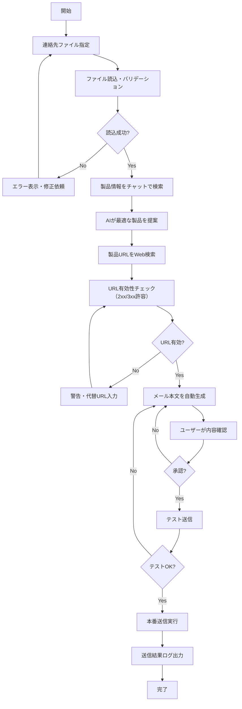

# 見積依頼スキル 要件定義書

## 1. 概要

### 1.1 目的
業者への見積依頼メール送信を効率化するスキルを作成する。AIチャットを活用して最適な製品を検索し、製品情報・ホームページURLを含むメールを自動生成してOutlookから送信する。

### 1.2 現状の課題
- Word差し込み機能で見積依頼メールを作成している
- 製品情報の検索・選定に手間がかかる
- 製品URLの調査が必要

---

## 2. システム構成

| 項目 | 選定 | 備考 |
|------|------|------|
| 製品情報検索 | AIチャット（本環境） | Web検索機能を使用 |
| 製品URL取得 | AIチャット（本環境） | 有効性チェック必須 |
| 連絡先データ | ユーザー指定 | CSV（Outlook形式対応） |
| メール送信 | Outlook連携 | win32com使用 |
| 実行環境 | 本AI環境 | Pythonスクリプト実行 |

---

## 3. 機能要件

### 3.1 製品検索機能
| 機能 | 説明 |
|------|------|
| チャット検索 | 自然言語で製品を問い合わせ、AIが最適な製品を提案 |
| Web検索 | 製品の公式ホームページURLを調査 |
| 情報整理 | 製品名、特徴、URLを整理して出力 |

### 3.2 AI検索結果の信頼性担保

> [!IMPORTANT]
> AI検索結果は必ずユーザー確認を経てから使用する

| 項目 | 対応方法 |
|------|----------|
| 出典確認 | 検索結果には情報源URL/サイト名を必ず付記 |
| URL有効性チェック | メール本文生成前にURLアクセス確認（詳細は下記） |
| 誤情報時の扱い | URLアクセス失敗時（4xx/5xx/接続エラー）は警告表示し、ユーザーに代替URL入力を促す |
| ユーザー確認 | 最終的な製品情報・URLはユーザー承認必須 |

**URL有効性チェックの通信条件:**

| 項目 | 仕様 |
|------|------|
| **許容スキーム** | `https://` のみ（`http://` は警告表示後にユーザー確認） |
| **内部アドレス遮断** | ローカルホスト・プライベートIP（10.x/172.16-31.x/192.168.x）はブロック |
| HTTPメソッド | HEAD（失敗時はGETにフォールバック） |
| 許容ステータス | 2xx / 3xx（リダイレクト追従は最大5回） |
| タイムアウト | 10秒 |
| リトライ回数 | 最大2回（間隔: 3秒） |
| User-Agent | 標準ブラウザ相当を設定 |

### 3.3 連絡先管理機能
| 機能 | 説明 |
|------|------|
| 連絡先インポート | ユーザー指定のCSVファイルを読み込み（Outlook形式対応） |
| 送付先一覧表示 | 送付対象の業者リストを確認（プレビュー） |
| 重複除外 | メールアドレス重複時は警告・除外 |

### 3.4 メール作成・送信機能
| 機能 | 説明 |
|------|------|
| メール本文生成 | 製品情報・URLを含むメール本文を自動作成 |
| プレビュー確認 | 送信前にユーザーが内容を確認・編集 |
| Outlook送信 | 確認後、Outlookから各社へメール送信 |

---

## 4. 一斉送信の安全要件

> [!CAUTION]
> 誤送信防止のため、以下の安全機能を実装する

| 項目 | 仕様 |
|------|------|
| **テスト送信モード** | 初回は自分宛にテストメール送信（本番送信前に必ず実行） |
| **件数上限** | 1回の実行で送信可能な最大件数を設定（デフォルト: 50件） |
| **ドメイン制限** | ホワイトリスト/ブラックリスト形式でドメイン制限可能（※下記優先順位参照） |
| **重複除外** | 同一メールアドレスへの重複送信を自動除外 |
| **送信間隔** | 連続送信時は3秒以上の間隔を空ける（スパム防止） |
| **二重確認** | 5件以上の送信時は最終確認ダイアログを表示 |
| **ドライラン** | 実際に送信せず処理内容のみ表示するモード |

**ドメイン制限の優先順位:**
1. ブラックリストに一致 → **拒否**（ホワイトリストより優先）
2. ホワイトリストが空 → 許可
3. ホワイトリストに一致 → 許可
4. 上記以外 → 拒否

---

## 5. ワークフロー



---

## 6. 入力仕様

### 6.1 連絡先ファイル仕様

| 項目 | 必須 | 説明 |
|------|:----:|------|
| **ファイル形式** | ○ | CSV形式（Outlookエクスポート形式対応） |
| **文字コード** | ○ | UTF-8 / Shift_JIS / CP932（自動判定、下記参照） |
| **ヘッダー行** | ○ | 1行目は列名として扱う |

**文字コード判定ルール:**

| 順位 | 判定方法 | 説明 |
|:----:|----------|------|
| 1 | BOM検出 | UTF-8 BOM付きの場合はUTF-8として読み込み |
| 2 | エンコーディング推定 | chardet/charset-normalizerで自動判定 |
| 3 | フォールバック | 判定失敗時はCP932→Shift_JIS→UTF-8の順で試行 |
| 4 | 手動指定 | 上記でも失敗時はユーザーに文字コード選択を促す |

**文字化け検出機能:**
- 読み込み後、制御文字や置換文字（�, □等）の有無をチェック
- 検出時は警告表示し、ユーザーに文字コードの手動指定を促す

### 6.2 必須列定義（エイリアス対応）

> [!NOTE]
> Outlookエクスポート形式との互換性のため、列名エイリアスを定義

| 標準列名 | エイリアス（許容する別名） | 型 | 必須 |
|----------|---------------------------|-----|:----:|
| `会社名` | `勤務先`, `Company`, `会社` | 文字列 | ○ |
| `担当者名` | （下記参照） | 文字列 | △ |
| `メールアドレス` | `電子メール アドレス`（※Outlook標準）, `電子メール`, `Email`, `E-mail` | 文字列 | ○ |
| `部署名` | `部署`, `Department` | 文字列 | - |
| `電話番号` | `会社電話`（※Outlook標準）, `電話番号 (会社)`, `勤務先電話`, `Phone` | 文字列 | - |

**担当者名の処理優先順位:**

| 優先度 | 条件 | 処理 |
|:------:|------|------|
| 1 | `担当者名` 列が存在 | そのまま使用 |
| 2 | `氏名` 列が存在 | そのまま使用 |
| 3 | `姓` + `名` 列が存在 | 「姓 名」の順で結合（間にスペース） |
| 4 | `姓` のみ存在 | 姓のみ使用 |
| 5 | いずれも存在しない | 「ご担当者様」を使用 |

※ `ミドル ネーム` 列は補助要素として、存在する場合は「姓 ミドル 名」の順で挿入

**エイリアス処理ルール:**
- 列名の前後空白はトリム
- 大文字/小文字は区別しない
- 複数エイリアスがマッチした場合、優先順位は上記の通り

### 6.3 バリデーションルール

| 項目 | ルール |
|------|--------|
| メールアドレス形式 | `email-validator` ライブラリで検証（`deliverable`チェックは無効） |
| 重複時の扱い | 同一メールアドレスは警告表示し、2件目以降を除外 |
| 空行の扱い | スキップ（警告なし） |
| 必須項目欠落 | エラー表示し、該当行をスキップ |

### 6.4 製品検索クエリ
| 項目 | 説明 |
|------|------|
| 形式 | テキスト（自然言語） |
| 例 | 「細胞培養用の96ウェルプレート、滅菌済み」 |

### 6.5 メールテンプレート（オプション）
| 項目 | 説明 |
|------|------|
| 形式 | Word（.docx）またはテキスト（.txt） |
| 差し込み変数 | `«会社名»`（Word形式）または `{{会社名}}`（汎用形式）の両方をサポート |

---

## 7. 出力仕様

### 7.1 製品情報
| 項目 | 必須 | 説明 |
|------|:----:|------|
| 製品名 | ○ | 正式製品名 |
| 特徴 | ○ | 製品の主な特徴（3点程度） |
| URL | ○ | 製品ホームページURL |
| 情報源 | ○ | 検索元サイト名/URL |

### 7.2 メール本文
| 項目 | 説明 |
|------|------|
| 件名 | 見積依頼の件名 |
| 本文 | 製品情報・URLを含む本文 |
| 送付先一覧 | 送信対象のリスト |

### 7.3 送信結果ログ（画面表示）
| 項目 | 説明 |
|------|------|
| 送信日時 | タイムスタンプ |
| 送信先 | **マスク表示**（例: `tan***@example.com`）|
| 会社名 | 送信先企業名 |
| 送信結果 | 成功/失敗 |

### 7.4 監査ログ（ファイル保存）

> [!NOTE]
> 監査ログは画面表示と異なり、完全な情報を暗号化保存する

| 項目 | 説明 |
|------|------|
| 実行ID | 一意の実行識別子（UUID） |
| 開始/終了時刻 | 処理開始・終了のタイムスタンプ（ISO8601形式） |
| 操作者 | 実行ユーザー情報（Windowsユーザー名） |
| 入力ファイル名 | 使用した連絡先ファイル名 |
| 送信総数 | 処理対象の総件数 |
| 成功数/失敗数 | 送信結果の集計 |
| 送信先詳細 | メールアドレス・会社名（**暗号化保存**） |
| エラー一覧 | 失敗した送信先とエラー内容 |
| Message-ID | 各送信メールの一意識別子（重複送信防止用） |

---

## 8. 失敗時フロー

### 8.1 送信失敗時の対応

> [!WARNING]
> リトライ時の二重送信を防止するため、送信済み判定を必ず行う

| ケース | 対応 |
|--------|------|
| **一時的エラー**（タイムアウト等） | 送信済み台帳を確認し、未送信の場合のみ最大3回リトライ |
| **永続的エラー**（アドレス不正等） | 失敗ログに記録し、次の送信先へ進む |
| **Outlook接続失敗** | 処理を中断し、エラー詳細を表示 |

### 8.2 二重送信防止メカニズム

| 処理 | 説明 |
|------|------|
| **送信前チェック** | 送信済み台帳を照合（下記キー定義参照） |
| **Message-ID記録** | 送信成功時にMessage-IDを台帳に記録（※下記取得方法参照） |
| **リトライ判定** | タイムアウト時は送信済みフォルダを確認してから再送 |

**Message-ID取得方法:**
```python
import datetime
import time

# Send()直後は取得不可のため、送信済みアイテムから照合して取得
subject_before_send = mail.Subject
recipient_before_send = mail.To  # 宛先も記録
sent_time_approx = datetime.datetime.now()
mail.Send()
time.sleep(2)  # Outlookの処理待機

# 送信済みフォルダからSubject+SentOn+Toで照合（GetLast()の競合回避）
sent_folder = outlook.GetNamespace("MAPI").GetDefaultFolder(5)
items = sent_folder.Items
items.Sort("[SentOn]", Descending=True)
message_id = None
for item in items:
    # Subject一致 + SentOnが送信時刻の前後60秒以内 + To一致
    if (item.Subject == subject_before_send and 
        abs((item.SentOn - sent_time_approx).total_seconds()) < 60 and
        item.To == recipient_before_send):
        message_id = item.PropertyAccessor.GetProperty(
            "http://schemas.microsoft.com/mapi/proptag/0x1035001F"
        )
        break
```
※ Subject + SentOn + To で照合し、一斉送信時の誤照合を防止

**Message-ID取得失敗時の対応:**
1. **再照合リトライ**: 最大3回、間隔2秒で再試行
2. **代替一意ID採番**: リトライ失敗時は以下の形式で代替IDを生成
   - 形式: `FALLBACK:{UUID}:{timestamp}:{subject_hash}`
   - 例: `FALLBACK:a1b2c3d4-...:1707456000:abc123`

※ 代替ID使用時は警告ログを出力し、監査ログに「Message-ID取得失敗」を記録

**二重送信防止のキー定義:**

| 判定レベル | キー構成 | 用途 |
|----------|---------|------|
| 同一実行内 | 実行ID + メールアドレス | リトライ時の重複防止 |
| 再実行時 | メールアドレス + 件名ハッシュ + 本文ハッシュ + 24時間以内 | 再実行時の同一内容送信防止 |

※ 再実行時に同一内容が検出された場合は警告表示し、ユーザー確認後に送信可否を選択

### 8.3 部分成功時のリカバリ

| 処理 | 説明 |
|------|------|
| 送信済みリスト保存 | 成功した送信先を別ファイルに保存（**メールアドレスは暗号化**） |
| 未送信リスト生成 | 失敗・未処理の送信先をCSV出力（**メールアドレスは暗号化**） |
| 再実行対応 | 未送信リストを入力として再実行可能（※下記フロー参照） |

**暗号化リストの再実行フロー:**
1. ユーザーが未送信リストファイルを指定
2. スキルがファイルを読み込み、暗号化列を自動検出（※下記形式定義参照）
3. Windows資格情報マネージャーから鍵を取得し、メールアドレスを復号
4. 復号済みデータで通常の送信フローを実行

※ 復号失敗時（鍵が存在しない等）はエラーを表示し、元のCSVファイルでの再実行を促す

**暗号化列の形式定義:**

| 要素 | 形式 | 例 |
|------|------|------|
| **列名** | `元列名_enc` サフィックス | `メールアドレス_enc` |
| **値** | `enc:v{version}:{ciphertext}` | `enc:v1:aBcD1234...` |

※ 列名と値ヘッダーの**両方一致**で暗号化列を識別（二重検出）
※ バージョン番号（v1, v2...）で将来の形式変更に対応

**暗号化列検出の失敗時挙動:**

| ケース | 挙動 |
|--------|------|
| 列名・値ヘッダー両方一致 | 暗号化列として処理（正常） |
| 片方のみ一致（不整合） | **エラー停止**（元CSVでの再実行を促すメッセージ表示） |
| どちらも不一致 | 平文列として処理（通常のCSV読み込み） |

※ 不整合エラー時はファイル破損またはバージョン不一致の可能性があるため、安全側に倒してエラー停止とする

> [!NOTE]
> 送信済み/未送信リストはメールアドレス部分のみ暗号化し、件数・日時・会社名は平文保存（運用利便性のため）

---

## 9. セキュリティ・個人情報の扱い

### 9.1 データ保護方針

| 項目 | 方針 |
|------|------|
| **データ保存期間** | 処理完了後、連絡先データはメモリから即時破棄（※リカバリ用リストは下記参照） |
| **アクセス制御** | 本スキルは実行ユーザーの権限で動作（Outlookの設定に従う） |
| **ログファイル** | ログは所定フォルダに保存し、90日後に自動削除を推奨 |
| **監査ログ暗号化** | 監査ログ内の個人情報（メールアドレス等）はAES-256で暗号化保存 |

### 9.1.1 暗号化鍵管理要件

| 項目 | 仕様 |
|------|------|
| **鍵の生成** | 初回実行時に自動生成（256bit乱数） |
| **鍵の保管場所** | Windows資格情報マネージャー（Credential Manager） |
| **鍵のローテーション** | 年1回、または管理者判断で手動実行 |
| **復号権限** | 鍵生成時のWindowsユーザーのみ（→実質的にスキル実行者） |
| **鍵喪失時の運用** | 既存ログは復号不可、新規鍵を生成して運用継続 |
| **バックアップ** | 鍵のエクスポート機能を提供（実行ユーザーのみ利用可） |

### 9.2 ログ表示のマスキング方針

| 表示場所 | マスキング |
|----------|-----------|
| 画面表示（リアルタイム） | 部分マスク（例: `tan***@example.com`） |
| 監査ログファイル | 暗号化保存（復号はスキル実行ユーザーのみ可能） |
| エラーログ | ドメイン部分のみ表示（例: `***@example.com`） |

### 9.3 外部送信に関する境界定義

> [!IMPORTANT]
> 「外部送信禁止」の対象範囲を明確化

| データ種別 | 外部送信 | 説明 |
|------------|:--------:|------|
| 連絡先データ（メールアドレス、会社名等） | ❌ 禁止 | AI/Webサービスへ送信しない |
| 製品検索クエリ（ユーザー入力） | ⭕ 許可 | AIチャット/Web検索に使用（※PII混入チェックあり） |
| 製品情報（検索結果） | ⭕ 許可 | AIから取得・メール本文に使用 |
| メール本文 | ⭕ 許可 | Outlook経由で送信先へ送信 |

**PII混入防止ルール:**

> [!CAUTION]
> 製品検索クエリに個人情報/連絡先情報が検出された場合は**送信をブロック**する

| 検出対象 | 検出方法 | 処理 |
|----------|----------|------|
| メールアドレス形式 | `xxx@domain.tld` パターン | **送信ブロック** |
| 電話番号形式 | ハイフン/空白除去後に連続数字10桁以上 | **送信ブロック** |
| 連絡先CSV内の会社名との完全一致 | 連絡先データとの照合 | **警告表示**（ブロックせず確認を促す） |

※ メールアドレス・電話番号検出時はエラーメッセージで該当箇所を明示し、削除/修正後に再実行を促す
※ 会社名一致時は警告のみ表示し、ユーザー確認後に続行可能
※ 電話番号検出例: `03-1234-5678`, `090 1234 5678`, `0312345678` → すべて検出対象

---

## 10. 関連ファイル

| ファイル | 相対パス |
|----------|----------|
| 見積依頼テンプレート | `./見積依頼_サンプル.docx` |
| 業者連絡先サンプル | `./業者連絡先_サンプル.csv` |

### 10.1 サンプルファイル分析結果（2026-02-09実施）

#### 業者連絡先_サンプル.csv

| 項目 | 内容 |
|------|------|
| 文字コード | CP932（Shift_JIS）← Outlookエクスポート形式 |
| 列数 | 95列（Outlook標準の連絡先フォーマット） |
| データ行 | 14行（有効データ2行） |

**確認済み列マッピング:**

| 要件定義書の列名 | 実際のCSV列名 |
|-----------------|---------------|
| 会社名 | `会社名` |
| 担当者名 | `姓`, `名` |
| メールアドレス | `電子メール アドレス` |
| 部署名 | `部署` |
| 電話番号 | `会社電話` |

#### 見積依頼_サンプル.docx

| 項目 | 内容 |
|------|------|
| 差し込み項目 | `«会社名»`, `«姓»` |
| 形式 | Word標準の差し込み印刷形式 |

> [!NOTE]
> 製品情報・URL等の差し込み項目は、スキル実装時にテンプレートへ追加が必要

---

## 11. 制約・前提条件

- Outlookがインストールされており、メール送信可能な状態であること
- 連絡先ファイルには必須項目（会社名、メールアドレス）が含まれていること
- インターネット接続が可能であること（製品URL検索・有効性チェックのため）
- Python実行環境があること（win32com使用のため）

---

## 12. 実装方法

### 12.1 Outlook送信の実装

```python
# win32comを使用したOutlook送信（概要）
import win32com.client

outlook = win32com.client.Dispatch("Outlook.Application")
mail = outlook.CreateItem(0)
mail.To = "recipient@example.com"
mail.Subject = "件名"
mail.Body = "本文"
mail.Send()
```

> [!NOTE]
> この環境ではMCP接続は未設定のため、Pythonスクリプト（win32com）でOutlookを制御します

---

## 13. 次のステップ

1. ~~**スキル設計**: 具体的なスキル構成（SKILL.md）の作成~~ → ✅ 完了
2. ~~**サンプルCSV分析**: 業者連絡先_サンプル.csvの列構成・文字コード確認~~ → ✅ 完了（§10.1参照）
3. ~~**テンプレート分析**: 見積依頼_サンプル.docxの差し込み項目確認~~ → ✅ 完了（§10.1参照）
4. ~~**Pythonスクリプト作成**: メール送信機能の実装~~ → ✅ 完了

### 運用開始前チェックリスト

- [x] 依存ライブラリインストール: `pip install -r requirements.txt`
- [x] ドライランテスト（`config.json` の `dry_run: true`）
- [x] 自分宛にテスト送信（2026-02-12 実施済み）
- [ ] 本番運用開始（`test_mode: false` に変更後、実運用送信で完了）

---

*作成日: 2026-02-06*  
*更新日: 2026-02-13（v14）*

## 変更履歴

| バージョン | 日付 | 変更内容 |
|-----------|------|----------|
| v1 | 2026-02-06 | 初版作成 |
| v2 | 2026-02-06 | 入力仕様、安全要件、失敗時フロー、セキュリティ要件を追加 |
| v3 | 2026-02-06 | 列名エイリアス対応、ログマスキング分離、URL判定緩和、二重送信防止、外部送信境界明確化 |
| v4 | 2026-02-06 | 担当者名処理優先順位明確化、暗号化鍵管理要件追加、URL通信条件詳細化、PII混入防止ルール追加 |
| v5 | 2026-02-06 | 復号権限の矛盾解消、PII検出時ブロック化、二重送信防止キー拡張（再実行対応） |
| v6 | 2026-02-06 | 外部送信禁止/会社名一致の競合解消、文字コード判定失敗時フォールバック追加、電話番号検出ルール強化 |
| v7 | 2026-02-09 | サンプルファイル分析結果を追加、メールアドレスエイリアスにOutlook標準形式を明記 |
| v8 | 2026-02-09 | 電話番号エイリアス「会社電話」追加、データ保護方針統一、Message-ID取得仕様追加、テンプレート両形式対応、ドメイン制限優先順位定義、メール検証ライブラリ指定、PII検出ルール緩和（会社名は警告のみ）、URLセキュリティ要件追加、次ステップ更新 |
| v9 | 2026-02-09 | Message-ID取得をSubject+SentOn照合方式に変更（競合回避）、暗号化リスト再実行フロー追加、PII検出注記整合、担当者名優先順位に「担当者名」列追加 |
| v10 | 2026-02-09 | Message-ID取得コードにSentOn照合を追加、取得失敗時のリトライ+代替ID対応追加、暗号化列形式定義（列名_enc+enc:v1:）追加 |
| v11 | 2026-02-09 | Message-ID照合条件に宛先(To)追加、datetimeインポート修正、暗号化列検出の失敗時挙動定義（不整合時はエラー停止） |
| v12 | 2026-02-09 | 実装完了に伴い次のステップを更新、運用開始前チェックリストを追加 |
| v13 | 2026-02-09 | 依存ライブラリ導入とドライラン検証を実施し、運用開始前チェックリストを更新 |
| v14 | 2026-02-13 | 運用開始前チェックリストを更新（自分宛テスト送信を完了化、本番運用開始条件を明確化） |
