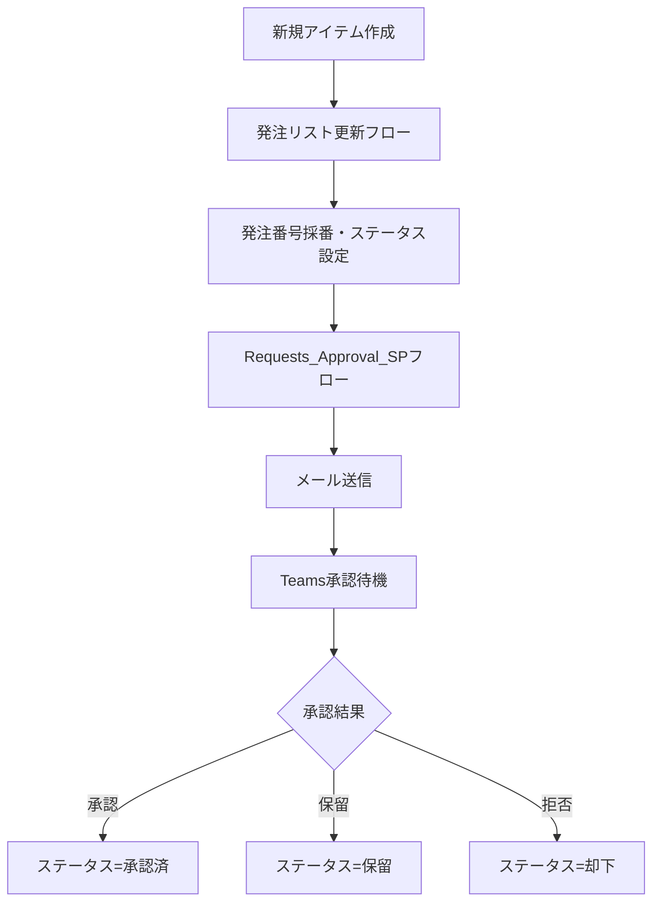

# SharePoint承認フロー 作業引継ぎ（2026/01/19）

**作成日**: 2026年1月19日 17:37  
**次回作業予定**: 2026年1月20日

---

## 本日完了した作業

### ✅ 1. 数量・見積額が0になる問題の解決

**問題**: フォームで入力した数量と見積額が、承認通知で0と表示され、SharePointでも0に上書きされていた。

**原因**:
- 「発注リスト更新」フローの「項目の更新1」アクションで`field_5`（注文数）が0に上書きされていた
- 式が`triggerBody()`を参照しており、トリガー時点ではデータが空/nullで0が設定されていた

**解決策**:
- 「発注リスト更新」フローの「項目の更新1」から**「注文数」フィールドを削除**
- 「Requests_Approval_SP」フローの各更新アクションに`field_5`と`field_6`を追加（`automation_1_0_0_23.zip`）

**ステータス**: ✅ **解決済み・動作確認済み**

---

### ✅ 2. Power Appsカスタムフォームへの復帰

- 標準フォームに一時切り替えてテスト後、カスタムフォームに戻した
- カスタムフォームでも正常に動作することを確認

**ステータス**: ✅ **完了**

---

### ⏸️ 3. メール添付ファイル機能（未完了）

**目的**: 承認依頼メールにSharePointリストの添付ファイル（見積書PDF等）を含める

**試みた内容**:
1. `GetAttachments` operationId → **存在しないためエラー**
2. `HttpRequest` operationId + REST API → **パラメータ形式エラー**

**現状**: JSONインポートでは動作せず、**Power AutomateのGUIで直接設定が必要**

**ステータス**: ⏸️ **明日に持ち越し**

---

## 明日の作業内容

### メール添付ファイル機能のGUI追加

**Power AutomateのGUIで以下を追加**:

1. 「項目の取得_最新データ」の後に追加：

   | 順番 | アクション | 設定 |
   |------|-----------|------|
   | ① | 添付ファイルの取得 | リスト: 発注依頼_Requests_Test, ID: アイテムID |
   | ② | 変数の初期化 | 名前: Attachments, 種類: 配列, 値: [] |
   | ③ | Apply to each | 添付ファイルをループ |
   | ④ | 添付ファイルのコンテンツ取得 | 各ファイルのバイナリ取得 |
   | ⑤ | 配列変数に追加 | Name + ContentBytes形式で追加 |

2. 「添付ファイル付きメール送信」アクション：
   - 添付ファイル: `variables('Attachments')`

---

## 関連ファイル

| ファイル | 場所 | 説明 |
|----------|------|------|
| automation_1_0_0_23.zip | `sharepointリスト化\` | 数量・見積額修正版（**現在使用中**） |
| automation_1_0_0_24.zip | `sharepointリスト化\` | 添付機能追加（インポートエラー） |
| automation_1_0_0_25.zip | `sharepointリスト化\` | 添付機能追加v2（インポートエラー） |
| 引継ぎ_数量金額問題解決_20260119.md | `sharepointリスト化\` | 数量問題の詳細引継ぎ |

---

## 現在の正常動作フロー

---

## 環境情報

| 項目 | 値 |
|------|-----|
| SharePointサイト | https://cellgentech.sharepoint.com/sites/SP__Prototype |
| リストID | 62b6ee4c-05b5-42e3-b9be-fe9fcc1ccdcd |
| リスト名 | 発注依頼_Requests_Test |
| 承認フロー | Requests_Approval_SP (SharePoint承認フロー) |
| 採番フロー | 発注リスト更新 |
