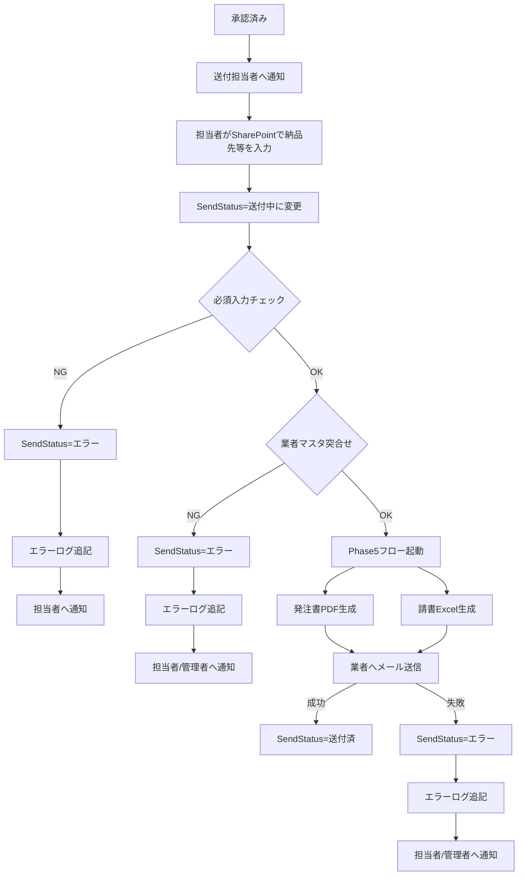

# Phase 5: 承認後送付フロー計画書

**最終更新**: 2026年1月30日 14:58  
**ステータス**: 📝 計画確定（実装待ち）

---

## 確定事項

| 項目 | 決定内容 |
|------|---------|
| 送付担当者 | 固定: sengas@cellgentech.com |
| トリガー方式 | A案: SharePointリスト手動更新 |
| 業者マスタ | `業者連絡先.csv`（固定名） |
| 発注書 | **Word→PDF自動生成** |
| 請書 | **Excel（業者が編集可能）** |

---

## フロー全体像

---

## SendStatus列定義

| 項目 | 内容 |
|------|------|
| 列名 | SendStatus |
| 内部名 | SendStatus |
| 型 | Choice（選択肢） |
| 必須 | ○ |
| 既定値 | 送付前 |

**許容値と遷移ルール**:

| 値 | 意味 | 遷移可能な状態 | 遷移条件 |
|----|------|----------------|----------|
| 送付前 | 初期状態（承認直後） | → 送付中 | 担当者が手動変更 |
| 送付中 | フロー実行中 | → 送付済 / エラー | フローが自動更新 |
| 送付済 | 正常完了 | （変更不可） | - |
| エラー | 処理失敗（入力NG/突合せNG/送信失敗） | → 送付中（リトライ） | 担当者が手動変更 |

**NG時のSendStatus遷移**:
- 必須入力チェックNG → **エラー**へ遷移（SendStatus=送付中のまま残らない）
- 業者マスタ突合せNG → **エラー**へ遷移
- メール送信失敗 → **エラー**へ遷移

**再実行手順**:
1. エラー原因を確認（エラーログ参照）
2. 入力データを修正
3. SendStatus を「送付中」に手動変更
4. フローが自動再実行

**制御ルール**:
- **二重送付防止**: SendStatus = 送付済 の場合、フローは起動しない
- **リトライ**: エラー状態からのみ「送付中」への再変更を許可
- **既送付判定**: フロー開始時にSendStatusを確認し、送付済なら処理をスキップ

---

## 業者マスタ定義

**ファイル仕様**:
| 項目 | 内容 |
|------|------|
| ファイル名 | `業者連絡先.csv`（固定名） |
| 配置場所 | SharePoint: `/Shared Documents/マスタ/` |
| 文字コード | UTF-8（BOM付き） |
| 区切り文字 | カンマ |

**参照ルール**:
- ファイル名は`業者連絡先.csv`で固定（yymmdd日付は廃止）
- 更新時は既存ファイルを上書き（バージョン履歴はSharePointのバージョン機能で管理）
- 複数ファイル存在時の混乱を回避

**列定義（スキーマ）**:

| 列名 | 内部名 | 型 | 必須 | 説明 |
|------|--------|-----|------|------|
| 業者ID | VendorID | テキスト | ○ | 一意キー（例: V001）※突合せキー |
| 業者名 | VendorName | テキスト | ○ | 表示用業者名 |
| メールアドレス | VendorEmail | テキスト | ○ | 送付先メールアドレス |
| 担当者名 | ContactPerson | テキスト | × | 業者側担当者名 |
| 電話番号 | PhoneNumber | テキスト | × | 連絡先電話番号 |

**突合せ方法**:
- SharePointリストの「業者ID（VendorID）」列とCSVの「業者ID（VendorID）」で完全一致検索
- 業者名での突合せは表記揺れ・同名混在リスクがあるため、業者IDをキーとする
- 一致しない場合はエラーとして処理を中断し、エラーログに記録

---

## 送付前必須チェック

フロー起動条件（全て満たす必要あり）:

| チェック項目 | 条件 | エラー時の動作 |
|--------------|------|----------------|
| 納品先 | 空白でないこと | SendStatus=エラー、エラーログ記録、担当者へ通知 |
| 業者ID | 空白でないこと | SendStatus=エラー、エラーログ記録、担当者へ通知 |
| 業者ID突合せ | 業者マスタに存在すること | SendStatus=エラー、エラーログ記録、担当者・管理者へ通知 |
| 見積書番号 | （空白許容） | チェックなし |

---

## 差し込みフィールド対応表

| 差し込みフィールド名 | SP内部名 | データ元 | 備考 |
|---------------------|----------|----------|------|
| `<<Title>>` | Title | SharePointリスト | 件名 |
| `<<品目>>` | ItemName | SharePointリスト | |
| `<<メーカー>>` | Manufacturer | SharePointリスト | |
| `<<数量>>` | Quantity | SharePointリスト | 数値 |
| `<<見積額>>` | EstimatedAmount | SharePointリスト | 通貨形式 |
| `<<納品先>>` | DeliveryAddress | SharePointリスト | |
| `<<見積書番号>>` | QuoteNumber | SharePointリスト | 空白可 |
| `<<業者名>>` | VendorName | 業者マスタCSV | |
| `<<業者メール>>` | VendorEmail | 業者マスタCSV | |
| `<<発注日>>` | （自動生成） | フロー実行日 | yyyy年MM月dd日 |

---

## 生成ファイル管理

**保存先**:
| 項目 | 内容 |
|------|------|
| 保存場所 | SharePoint: `/Shared Documents/送付済/yyyy年/MM月/` |
| 命名規則（発注書） | `発注書_[SharePointリストID]_[業者ID]_yyyyMMdd.pdf` |
| 命名規則（請書） | `請書_[SharePointリストID]_[業者ID]_yyyyMMdd.xlsx` |

> **注記**: `[SharePointリストID]`はSharePointリストの自動採番ID（数値）。Titleや業者名は禁止文字・長さ超過リスクのため使用しない。

**ファイル名サニタイズルール**:
- Title/業者名は禁止文字（\ / : * ? " < > |）や長さ超過リスクがあるため、ファイル名にはSharePointリストID（数値）と業者ID（VendorID）を使用
- ファイル名の最大長: 128文字以内
- 禁止文字が含まれる場合は「_」に置換（安全策として実装）

**保管・権限**:
| 項目 | 内容 |
|------|------|
| 保管期間 | 7年間 |
| 保管根拠 | 法人税法施行規則第59条（帳簿書類の保存期間7年）※発注書・請書は取引証憑書類に該当 |
| 参照権限 | 経理担当者、購買担当者、管理者 |
| 編集権限 | 管理者のみ |

---

## 実装ステップ

### Step 1: SharePointリスト列追加

| 列名 | 内部名 | 型 | 必須 | 備考 |
|------|--------|-----|------|------|
| 納品先 | DeliveryAddress | テキスト | ○ | |
| 見積書番号 | QuoteNumber | テキスト | × | 空白許容 |
| 業者ID | VendorID | テキスト | ○ | 業者マスタとの突合せキー |
| 業者名 | VendorName | テキスト | × | 表示用（業者マスタから自動取得可） |
| SendStatus | SendStatus | Choice | ○ | 既定値: 送付前 |
| ErrorLog | ErrorLog | 複数行テキスト | × | エラー履歴記録用（追記式） |

**ErrorLog記録形式**:
- **追記方式**: 既存内容の末尾に新行追加（上書きしない）
- **フォーマット**: `[yyyy-MM-dd HH:mm:ss] [エラー種別] エラー詳細`
- **例**: `[2026-01-30 14:30:00] [業者マスタ不整合] VendorID=V999 が業者マスタに存在しません`
- **エラー種別**: `必須入力NG`, `業者マスタ不整合`, `メール送信失敗`

---

### Step 2: 承認フロー修正

承認完了時に送付担当者へ通知を追加。

---

### Step 3: テンプレート準備

| ファイル | 形式 | 用途 |
|----------|------|------|
| 発注書テンプレート | Word (.docx) | PDF変換用 |
| 請書テンプレート | Excel (.xlsx) | 業者編集用 |

---

### Step 4: 送付フロー作成

**トリガー**: SendStatus = 送付中

**処理**:
1. 必須入力チェック（納品先、業者ID）
   - NG時: SendStatus=エラー、ErrorLog記録、担当者へ通知
2. 業者マスタCSVから業者情報取得（業者IDで突合せ）
   - NG時: SendStatus=エラー、ErrorLog記録、担当者・管理者へ通知
3. Word差し込み → PDF変換
4. Excel差し込み
5. メール送信（PDF + Excel添付）
   - 失敗時: SendStatus=エラー、ErrorLog記録、担当者・管理者へ通知
6. SendStatus更新（成功: 送付済）

**エラー通知**:
| エラー種別 | 送付担当者 | 管理者 |
|--------------|--------------|--------|
| 必須入力NG | ○ | - |
| 業者マスタ不整合 | ○ | ○ |
| メール送信失敗 | ○ | ○ |

---

## 実装前の準備作業

- [ ] SharePointに「納品先」列を追加
- [ ] SharePointに「見積書番号」列を追加（空白可）
- [ ] SharePointに「業者ID」列を追加（必須、業者マスタ突合せキー）
- [ ] SharePointに「業者名」列を追加（任意、表示用）
- [ ] SharePointに「SendStatus」列を追加（Choice型）
- [ ] SharePointに「ErrorLog」列を追加（複数行テキスト、追記式）
- [ ] 発注書Wordテンプレート作成（差し込みフィールド対応表に準拠）
- [ ] 請書Excelテンプレート作成（差し込みフィールド対応表に準拠）
- [ ] 業者CSVをSharePointにインポート
- [ ] 送付済フォルダ構成を作成

---

## 次のアクション

準備完了後、「実装開始」とお知らせください。
