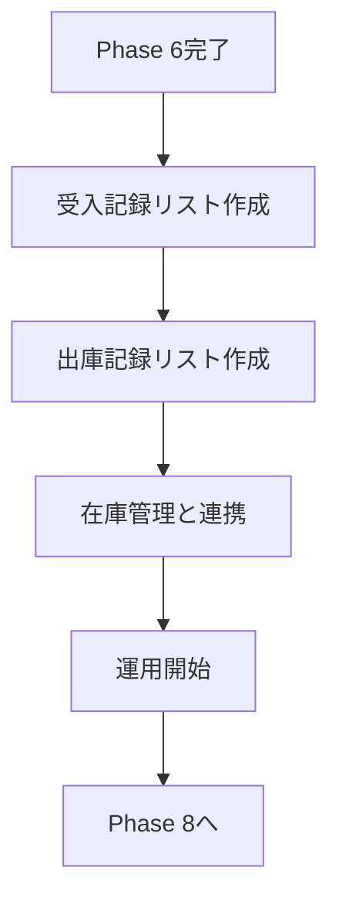
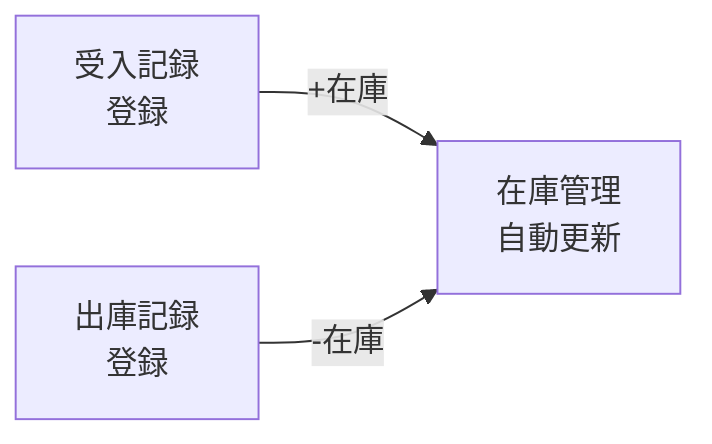

# Phase 7: 受入・出庫記録計画書

**最終更新**: 2026年1月30日  
**ステータス**: 📋 v3.1 レビュー指摘対応済・手順整合版

---

## 概要

| 項目 | 内容 |
|-----|------|
| 目的 | 入出庫記録のデジタル化・将来のバーコード管理への準備 |
| 対象シート | 受入・出庫記録書、使用記録書 |
| 優先度 | 🟡 中（Phase 6完了後） |

---

## フロー全体像

> [!NOTE]
> 「使用記録」は「出庫記録」に統合して管理します。

---

## 対象シートの現状

| シート名 | 行数 | 列数 | 用途 |
|---------|------|------|------|
| 試薬・資材受入・出庫記録書 | 44 | 12 | 受入検査記録 |
| 使用記録書 | 41 | 12 | 試薬使用記録 |
| 使用記録書2枚目 | 41 | 11 | 続き |

---

## 実装ステップ

### Step 1: 受入記録リスト作成

**リスト名**: `受入記録`

| 列名 | 内部名 | 型 | 必須 | 備考 |
|-----|--------|-----|-----|------|
| 受入日 | ReceiveDate | 日付 | ○ | ユニークキーの一部 |
| 在庫品目 | InventoryItem | ルックアップ | ○ | 在庫管理リストへ参照 |
| 品名 | Title | 1行テキスト | ○ | Lookup関連フィールド |
| メーカー | Maker | 1行テキスト | ○ | Lookup関連フィールド |
| **数量単位** | **QuantityUnit** | 1行テキスト | ○ | **New** Lookup関連フィールド（Phase 6参照） |
| メーカーコード | MakerCode | 1行テキスト | ○ | **スナップショット**（保存時にマスタから値をコピー） |
| 枝番 | BranchNumber | 1行テキスト | ○ | **New** 必須 (空の場合は "00" を自動セット) |
| ロット番号 | LotNumber | 1行テキスト | ○ | ユニークキーの一部 |
| 数量 | Quantity | 数値 | ○ | 0より大きい値 |
| 使用期限 | ExpiryDate | 日付 | - | |
| 検査結果 | InspectionResult | 選択肢 | ○ | 合格/不合格/保留 |
| 担当者 | Person | ユーザー | ○ | |
| 備考 | Notes | 複数行テキスト | - | |
| 複合キー | CompositeKey | 1行テキスト | ○ | `InventoryItemId-Lot-yyyymmdd` (一意性担保) |
| バーコード | BarcodeKey | 1行テキスト | - | `MakerCode-Branch-Lot-YYMMDD` (表示用) |

> [!TIP]
> **Lookup関連フィールド設定**  
> 「在庫品目」列の設定で以下の関連フィールドを追加することで、品目選択時に自動入力（表示）されます:
> - 品名 (Title)
> - メーカー (Maker)
> - **数量単位 (QuantityUnit)**
> - ※**MakerCode** はスナップショットとしてPower Appsで値を取得します（関連フィールドではありません）。

> [!IMPORTANT]
> **ユニークキー: 在庫品目(ID) + ロット番号 + 受入日**  
> 同じロット番号で複数回受入する可能性があるため、受入日を含めた複合キーで一意性を確保します。  
> CompositeKey式: `InventoryItem.Id & "-" & LotNumber & "-" & TEXT(ReceiveDate, "yyyymmdd")`

**検査結果の選択肢**: 合格 / 不合格 / 保留

---

> [!IMPORTANT]
> **データ整合性とキー管理**
> 
> 1. **CompositeKey再計算時の注意**
>    - 再計算スクリプト実行時は、一時的にSharePoint側の一意制約を**無効化**してください（重複エラーによる中断を防ぐため）。
>    - 計算完了後、重複がないことを確認して再度一意制約を有効化します。
> 
> 2. **BranchNumber変更時の同期**
>    - Phase 6側で `BranchNumber`（枝番）が変更された場合、以下の2つを必ず再計算・更新してください：
>      - `BarcodeKey`（MakerCode + BranchNumber + Lot + Date）  
>    - ※CompositeKeyは `InventoryItem.Id` 依存のため、枝番変更のみでは再計算不要です。
>    - ※片方のみの更新はデータの不整合（バーコードと実態の乖離）を招くため禁止です。

> 3. **BranchNumber=00 の正規化と運用**
>    - **ルール**: `BranchNumber` は必須です。値が不明な場合は初期値 "00" を使用します。
>    - **Phase 6**: 空欄データはスクリプトで一括して "00" に置換します。
>    - **Phase 7**: リスト設定で既定値を "00" に設定します。
>    - **運用**: 暫定 "00" で登録されたデータは、後日正しい枝番（-01, -02等）が判明した時点で修正し、バーコードを再発行してください。
>
> 4. **入力経路の制限（Power Apps推奨）**
>    - `MakerCode` などのスナップショット列を正しく保存するため、受入・出庫の新規登録は**Power Appsフォーム**の使用を原則とします。
>    - SharePoint標準の「グリッドビュー編集」等ではスナップショットロジックが動かず、データ不整合の原因となります。
>
### Step 2: 出庫記録リスト作成

**リスト名**: `出庫記録`

| 列名 | 内部名 | 型 | 必須 | 備考 |
|-----|--------|-----|-----|------|
| 出庫日 | IssueDate | 日付 | ○ | |
| 在庫品目 | InventoryItem | ルックアップ | ○ | 在庫管理リストへ参照 |
| 受入記録 | ReceiptRecord | ルックアップ | - | **New** 元の受入記録（トレーサビリティ用） |
| 品名 | Title | 1行テキスト | ○ | Lookup関連フィールド |
| メーカー | Maker | 1行テキスト | ○ | Lookup関連フィールド |
| **数量単位** | **QuantityUnit** | 1行テキスト | ○ | **New** Lookup関連フィールド |
| ロット番号 | LotNumber | 1行テキスト | ○ | |
| 数量 | Quantity | 数値 | ○ | 0より大きく在庫残量以下 |
| 用途 | Purpose | 選択肢 | ○ | 廃棄/その他は備考必須 |
| 使用者 | User | ユーザー | ○ | |
| 試験番号 | TestNumber | 1行テキスト | - | |
| 備考 | Notes | 複数行テキスト | 条件付 | 廃棄/その他選択時は必須 |

**用途の選択肢**: 製造 / 試験 / 検査 / 研究開発 / サンプル提供 / 廃棄 / その他

> [!TIP]
> **Lookup関連フィールド設定**  
> 受入記録と同様に、「在庫品目」列で品名・メーカー・数量単位を関連フィールドとして追加します。

> [!WARNING]
> **出庫バリデーションルール**
> - 数量は0より大きい値のみ許可
> - 出庫数量が在庫残量を超える場合はエラー
> - 在庫残量チェックはPower Automateで実装（手動運用時は目視確認）

> [!IMPORTANT]
> **用途別入力規則**
> - **廃棄**: 備考欄に廃棄理由を必須入力（例: 期限切れ、破損、汚染）
> - **その他**: 備考欄に詳細用途を必須入力
> - 条件付き必須フィールドはPower Appsまたは運用ルールで実施

---

### Step 3: 在庫連携（オプション）

**連携方法**: Power Automateで自動更新（Phase 6完了後の手動運用評価を経て判断）

#### 在庫自動更新フローの堅牢性設計

> [!CAUTION]
> **フロー堅牢性要件**
> 
> **1. リトライ処理**
> - 在庫更新失敗時は自動再試行（最大3回、間隔: 5秒）
> - 3回失敗後は管理者にメール通知
> 
> **2. 排他制御**
> - 同時更新防止のためアイテムバージョン管理を使用
> - 更新前にバージョンチェック、競合時は再取得して再試行
> 
> **3. 監査ログ**
> - 専用の「在庫更新ログ」リストに記録:
>   - Who: 実行ユーザー
>   - When: 更新日時
>   - What: 品目、ロット、数量変更
>   - Result: 成功/失敗/エラー詳細
> 
> **4. エラーハンドリング**
> - Try-Catch構造で全エラーをキャッチ
> - エラー内容をログに記録
> - 重大エラー時はTeams/メールで即時通知

---

### Step 4: 将来のバーコード対応準備

#### バーコード仕様

| 項目 | 仕様 |
|------|------|
| **規格** | Code128（英数字・記号対応、高密度） |
| **フォーマット** | `MakerCode-BranchNumber-Lot-Date` |
| **生成ロジック** | 下記の実装パターン参照 |
| **貼付位置** | 容器正面または上部（読み取りやすい位置） |
| **ラベルサイズ** | 40mm × 20mm（推奨） |

#### BarcodeKey生成ロジックと正常系・異常系

| ケース | 条件 | 生成フォーマット (例) | 期待される挙動 |
|--------|------|-----------------------|----------------|
| **正常系** | MakerCodeあり BranchNumberあり | `[MakerCode]-[Branch]-[Lot]-[Date]` 例: `TOK-01-L123-260130` | 正常生成（式: `MakerCode & "-" & BranchNumber & "-" & LotNumber & "-" & TEXT(ReceiveDate, "yymmdd")`） |
| **異常系1** | MakerCodeなし | `ERR-NO_MAKER-[Branch]-[Lot]` | エラーまたは仮コード。要マスタ整備 |
| **異常系2** | BranchNumberなし | `[MakerCode]-00-[Lot]-[Date]` 例: `TOK-00-L123-260130` | 暫定 "00" で生成。 後で正しい枝番へ修正必須 |
| **異常系3** | BranchNumber変更 | (再計算が必要) | `BranchNumber` 変更トリガーでバーコードも自動更新すること |

#### 実装ステップ

| 準備項目 | 内容 | 実装方法 |
|---------|------|----------|
| バーコード列追加 | 受入記録・在庫管理リストに追加 | 1行テキスト型 |
| バーコード自動生成 | 受入記録作成時に自動生成 | Power Automate: `MakerCode & "-" & BranchNumber & "-" & LotNumber & "-" & TEXT(ReceiveDate,"yymmdd")` |
| ラベル発行トリガー | 受入記録登録時に自動発行 | Power Automate → ラベルプリンター連携 |
| ラベル印刷 | バーコードラベルの印刷 | Brother QL-820NWB等のネットワークプリンター |
| 印刷責任者 | ラベル印刷・貼付の実施者 | 受入担当者（自動印刷、手動貼付） |
| 読み取りアプリ | スキャンで出庫登録 | Power Appsのバーコードスキャナー機能 |
| 運用フロー | 受入→ラベル貼付→出庫スキャン | 段階的導入（まず受入から） |

> [!NOTE]
> バーコード対応は段階的に導入します:
> 1. Phase 7完了後、まず受入記録でバーコード列を追加
> 2. ラベル印刷環境を整備（プリンター選定・設置）
> 3. Power Appsでスキャンアプリを開発
> 4. 運用テスト後、本格展開

---

## 実装前の準備作業

- [x] 「受入・出庫記録書」シートの列名詳細確認
- [x] 「用途」選択肢の一覧作成
- [x] 指摘事項7点への対応完了
- [ ] Phase 6 在庫管理リストの運用開始
- [ ] Lookup関連フィールドの設定手順書作成
- [ ] 重複検知ビューの作成
- [ ] バリデーションルールの実装方法確定
- [ ] 在庫更新ログリスト作成(Who/When/What/Result列)
- [ ] 通知先設定(管理者メールアドレス、Teamsチャネル)
- [ ] フロー堅牢性テスト(リトライ、排他制御、エラーハンドリング)

---

## 次のアクション

1. **Phase 6完了待ち**: 在庫管理リストの運用開始
2. **受入記録リスト作成**: Lookup関連フィールド設定を含む
3. **出庫記録リスト作成**: バリデーションルール実装
4. **Power Automateフロー開発**: 在庫自動更新（堅牢性設計に基づく）
5. **運用テスト**: 手動運用で課題抽出
6. **バーコード対応**: 段階的導入

---

## 改訂履歴

| 日付 | バージョン | 変更内容 |
|------|-----------|----------|
| 2026-01-23 | 1.0 | 初版作成 |
| 2026-01-30 | 2.0 | 指摘事項7点対応: Lookup関連フィールド、ユニークキー設計、数量単位、バリデーション、記録粒度、フロー堅牢性、バーコード仕様 |
| 2026-01-30 | 2.1 | v2.0追加指摘4点対応: 出庫記録にメーカー列追加、Phase依存統一(Phase 6)、準備作業拡充、バーコード自動生成ロジック明文化 |
| 2026-01-30 | 3.0 | レビュー指摘対応(v2.2統合): キー設計統一(InventoryItemID-Lot-Date)、受入記録にMakerCode/BranchNumber列追加(スナップショット)、出庫記録に受入記録ID追加(トレーサビリティ) |
| 2026-01-30 | 3.1 | マージ重複削除、バーコード生成式修正、BranchNumber必須化対応 |
