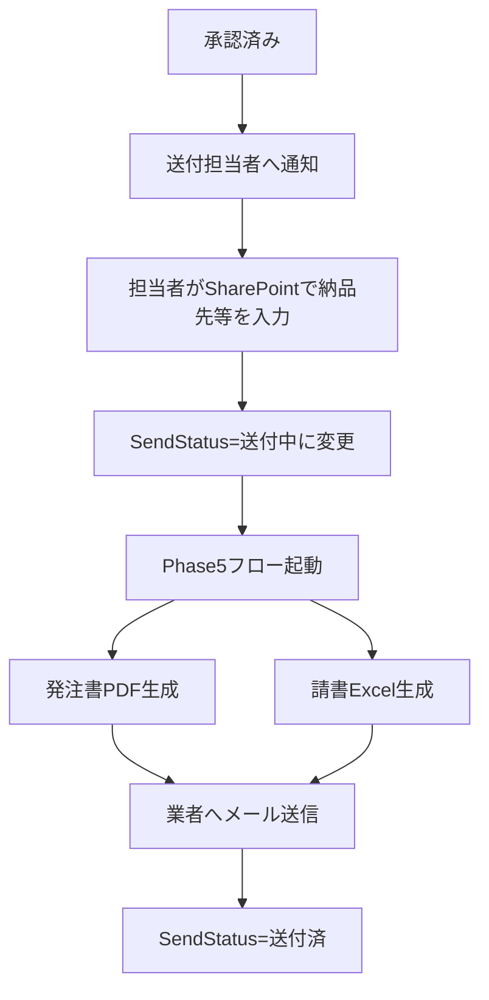

# Phase 5: 承認後送付フロー計画書

**最終更新**: 2026年1月20日 17:44  
**ステータス**: 📝 計画確定（実装待ち）

---

## 確定事項

| 項目 | 決定内容 |
|------|---------|
| 送付担当者 | 固定: sengas@cellgentech.com |
| トリガー方式 | A案: SharePointリスト手動更新 |
| 業者マスタ | `業者連絡先yymmdd.csv` |
| 発注書 | **Word→PDF自動生成** |
| 請書 | **Excel（業者が編集可能）** |

---

## フロー全体像

---

## 実装ステップ

### Step 1: SharePointリスト列追加

| 列名 | 内部名 | 型 | 必須 |
|------|--------|-----|------|
| 納品先 | DeliveryAddress | テキスト | ○ |
| 見積書番号 | QuoteNumber | テキスト | × |

---

### Step 2: 承認フロー修正

承認完了時に送付担当者へ通知を追加。

---

### Step 3: テンプレート準備

| ファイル | 形式 | 用途 |
|----------|------|------|
| 発注書テンプレート | Word (.docx) | PDF変換用 |
| 請書テンプレート | Excel (.xlsx) | 業者編集用 |

**差し込みフィールド**:
- Title, 品目, メーカー, 数量, 見積額
- 納品先, 見積書番号（空白可）
- 業者名（業者マスタから）

---

### Step 4: 送付フロー作成

**トリガー**: SendStatus = 送付中

**処理**:
1. Word差し込み → PDF変換
2. Excel差し込み
3. メール送信（PDF + Excel添付）
4. SendStatus更新

---

## 実装前の準備作業

- [ ] SharePointに「納品先」列を追加
- [ ] SharePointに「見積書番号」列を追加（空白可）
- [ ] 発注書Wordテンプレート作成
- [ ] 請書Excelテンプレート作成
- [ ] 業者CSVをSharePointにインポート

---

## 次のアクション

準備完了後、「実装開始」とお知らせください。
