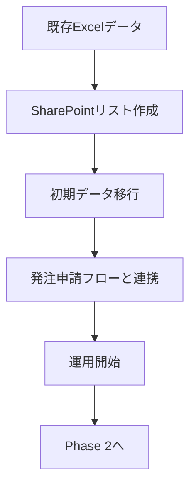

# Phase 6: 在庫管理リスト計画書

**最終更新**: 2026年1月23日  
**ステータス**: ✅ リスト作成完了、ビュー設定ガイド作成完了（Step 3-4実施中）

---

## 概要

| 項目 | 内容 |
|-----|------|
| 目的 | 在庫状況のリアルタイム共有・発注申請との連携 |
| 対象シート | 在庫（33行×74列） |
| 優先度 | 🔴 最優先 |

---

## フロー全体像

---

## 実装ステップ

### Step 1: SharePointリスト作成

**リスト名**: `在庫管理`

| 列名 | 内部名 | 型 | 必須 | 説明 |
|-----|--------|-----|-----|------|
| 品名 | Title | 1行テキスト | ○ | 試薬・資材名 |
| メーカー | Maker | 1行テキスト | ○ | 製造元 |
| メーカーコード | MakerCode | 1行テキスト | ○ | 製品番号 |
| 枝番 | BranchNumber | 1行テキスト | - | 同一品目のロット違い管理用（-1, -2等） |
| 包装形状 | PackageType | 1行テキスト | - | 梱包形態 |
| 入数/箱 | UnitsPerBox | 数値 | - | 1箱あたり個数 |
| 発注業者 | Vendor | 1行テキスト | - | 発注リストと連携 |
| 発注ID | SourceOrderID | 1行テキスト | - | 連携キー (YYDD-000-PJ) |
| 単価 | UnitPrice | 通貨 | - | 発注リストと連携 ※計算用のため実数値として保持 |
| 現在在庫数 | CurrentStock | 数値 | ○ | 現時点の在庫 |
| 在庫金額 | InventoryValue | 計算値 | - | 単価 × 在庫数 |
| 発注者 | Orderer | ユーザー | - | 発注リストと連携 |

| 保管場所 | StorageLocation | 選択肢（複数選択可） | - | 204, 101, 未来, 7F, 動物舎 ※セット品で場所が分かれる場合に対応 |
| 保管温度 | StorageTemperature | 選択肢（複数選択可） | - | 常温, 4℃, -30℃, -80℃ ※「常温＋冷凍」などの組み合わせに対応 |
| 使用期限 | ExpiryDate | 日付 | - | 有効期限 |
| バーコード | Barcode | 1行テキスト | - | 将来用 |
| ロット番号 | LotNumber | 1行テキスト | - | 最新または管理対象のロット |
| 納品日 | DeliveryDate | 日付 | - | 物品が届いた日（受入検査日とは別） |
| 受入検査日 | InspectionDate | 日付 | - | 検品を行った日 |
| COA入手日 | COA_Date | 日付 | - | 成績書入手日 |
| 備考 | Notes | 複数行テキスト | - | メモ |

---

### Step 2: 初期データ移行

| # | タスク | 方法 |
|---|-------|------|
| 1 | Excelで移行対象データ抽出 | 不要列削除、整形 |
| 2 | SharePointへインポート | Excel直接インポートまたはコピペ |
| 3 | データ確認・修正 | 目視確認 |

**移行方法の選択肢**:
- **A案**: Excelファイルからの直接インポート（簡単・推奨）
- **B案**: Power Automateでの自動移行（複雑だが正確）

---

### Step 3: 発注申請フローとの連携

**連携オプション**:
| オプション | 内容 | 推奨 |
|-----------|------|-----|
| A. 手動更新 | 入荷時に手動で在庫数を更新 | ○ **採用**（※手数を少なく工夫） |
| B. 自動更新 | Power Automateで自動更新 | 将来検討 |

---

### Step 4: 動作確認

| # | 確認項目 |
|---|---------|
| 1 | リスト表示・編集が正常にできるか |
| 2 | フィルター・ソートが使えるか |
| 3 | 発注申請リストと整合性があるか |
| 4 | 「手数は少なく」を実現できているか（グリッドビュー活用等） |

---

## 実装前の準備作業

- [x] 保管場所の選択肢を決定 → 204, 101, 未来, 7F, 動物舎
- [x] 保管温度の選択肢を決定 → 常温, 4℃, -30℃, -80℃
- [ ] Excelから移行対象データを特定
- [ ] 既存の「在庫」シートの列名を確認

---

## セット品の対応案

セット品（キットなど）の管理方法として、以下の2パターンを提案します。

| パターン | 内容 | メリット | デメリット |
|---|---|---|---|
| **A. 親品目管理（推奨）** | キット全体を「1つ」として登録し、保管場所・温度を複数選択 | 管理がシンプル。 例：温度「常温」「-30℃」、場所「常温棚」「冷凍庫」を両方選択 | 構成品の個別在庫は見えない |
| **B. 構成品展開** | キットとしての登録はせず、構成品（Bottle A, B...）を個別に登録 | 正確な在庫把握 | 登録・更新の手間が倍増 |

**推奨案（A）の運用イメージ**:
- 品名：「〇〇抽出キット」
- 在庫数：キットの箱数で管理
- 備考欄に「構成品：Buffer A, Buffer B...」と記載しておく

### ロット管理・日付管理の方針

現状の運用（枝番管理）に合わせて、**「1ロット＝1行」** とします。

- 同一商品でも、ロットが変われば**行を追加**します。
- 区別するために「枝番」列（-01, -02など）または「ロット番号」を使用します。
- これにより、「古いロットの在庫」と「新しいロットの在庫」を正確に分けて管理可能です。

---

## ユーザー確認事項（再掲）

1. **保管場所**の選択肢は？（例：冷蔵庫A、常温棚1等）
2. **手動更新**から始めてよいか？

---

### 在庫金額の集計について

SharePointリスト上で管理することをお勧めします。
「単価」と「在庫金額（計算列）」を追加することで、**リスト上で常に最新の在庫総額を確認**できるようになります。

- **単価列**: 追加します。
- **在庫金額列**: `=[単価] * [現在在庫数]` の計算式を設定します。
- **集計**: リストビューの集計機能で、合計金額を常に表示させます。

### 発注リストとの連携について

**連携キーは「発注ID（YYDD-000-PJ）」を使用します。**
品名だと「同じ商品を別の日にもう一度買った」場合に区別がつかなくなりますが、発注IDであれば一意に特定できるためです。

- **新規項目の追加**: 「発注ID」列を追加しました。
- **運用の流れ**: 在庫登録時に、元となった発注の発注IDを入力（コピー）することで、後から「いつ、どの発注で買ったものか」を確実に追跡できます。

---

## 次のアクション

**✅ 2026/01/23 完了**: 
- SharePointリスト「在庫管理」作成完了
- サンプルデータ13件投入済み（DMEM培地、FBS等）

**⏳ Step 2: データ移行状況**:
- `物品管理リストひな形.xlsx`の「在庫」シート → 2件のみ（テンプレート）
- `在庫管理.xlsx` → 13件（SharePointにインポート済み）
- 本番の大量データ（33行）の所在確認が必要

**📋 次のステップ**:
1. [ ] 本番在庫データファイルの所在確認
2. [ ] ビュー設定（フィルター、並び替え等）
3. [ ] 発注申請リストとの運用連携テスト
