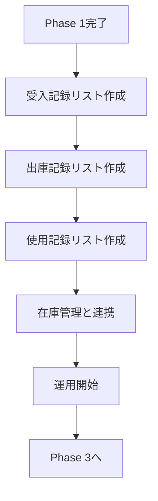
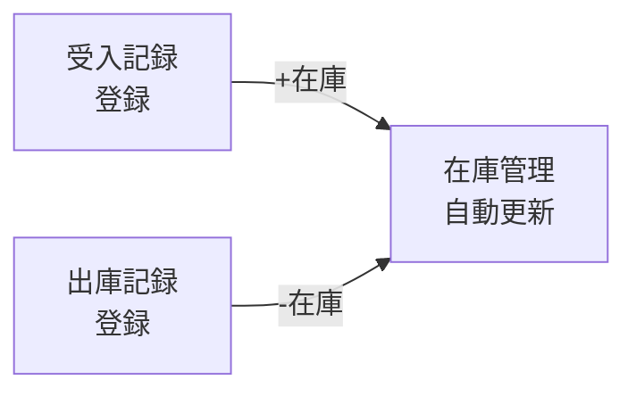

# Phase 7: 受入・出庫記録計画書

**最終更新**: 2026年1月23日  
**ステータス**: 📝 手動作成手順書作成完了（リスト作成待ち）

---

## 概要

| 項目 | 内容 |
|-----|------|
| 目的 | 入出庫記録のデジタル化・将来のバーコード管理への準備 |
| 対象シート | 受入・出庫記録書、使用記録書 |
| 優先度 | 🟡 中（Phase 1完了後） |

---

## フロー全体像

---

## 対象シートの現状

| シート名 | 行数 | 列数 | 用途 |
|---------|------|------|------|
| 試薬・資材受入・出庫記録書 | 44 | 12 | 受入検査記録 |
| 使用記録書 | 41 | 12 | 試薬使用記録 |
| 使用記録書2枚目 | 41 | 11 | 続き |

---

## 実装ステップ

### Step 1: 受入記録リスト作成

**リスト名**: `受入記録`

| 列名 | 内部名 | 型 | 必須 |
|-----|--------|-----|-----|
| 受入日 | ReceiveDate | 日付 | ○ |
| 品名 | Title | 1行テキスト | ○ |
| メーカー | Maker | 1行テキスト | ○ |
| ロット番号 | LotNumber | 1行テキスト | ○ |
| 数量 | Quantity | 数値 | ○ |
| 使用期限 | ExpiryDate | 日付 | - |
| 検査結果 | InspectionResult | 選択肢 | ○ |
| 担当者 | Person | ユーザー | ○ |
| 備考 | Notes | 複数行テキスト | - |

**検査結果の選択肢**: 合格 / 不合格 / 保留

---

### Step 2: 出庫記録リスト作成

**リスト名**: `出庫記録`

| 列名 | 内部名 | 型 | 必須 |
|-----|--------|-----|-----|
| 出庫日 | IssueDate | 日付 | ○ |
| 品名 | Title | 1行テキスト | ○ |
| ロット番号 | LotNumber | 1行テキスト | ○ |
| 数量 | Quantity | 数値 | ○ |
| 用途 | Purpose | 選択肢 | - |
| 使用者 | User | ユーザー | ○ |
| 試験番号 | TestNumber | 1行テキスト | - |
| 備考 | Notes | 複数行テキスト | - |

---

### Step 3: 在庫連携（オプション）

**連携方法**: Power Automateで自動更新（Phase 1での手動運用評価後に判断）

---

### Step 4: 将来のバーコード対応準備

| 準備項目 | 内容 |
|---------|------|
| バーコード列追加 | 各リストにバーコード列を追加 |
| ラベル印刷 | バーコードラベルの印刷方法検討 |
| 読み取りアプリ | Power Appsでスキャンアプリ作成 |

---

## 実装前の準備作業

- [ ] 「受入・出庫記録書」シートの列名詳細確認
- [ ] 「用途」選択肢の一覧作成
- [ ] Phase 1 在庫管理リストの運用開始

---

## 次のアクション

Phase 1完了後、詳細設計を進めます。
