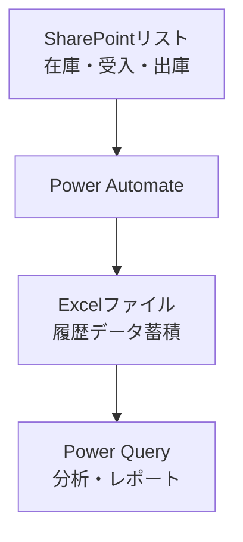
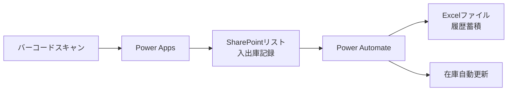

# Phase 3: 大量データ連携計画書

**最終更新**: 2026年1月21日  
**ステータス**: 📋 Phase 2完了後に検討

---

## 概要

| 項目 | 内容 |
|-----|------|
| 目的 | 大量の履歴データをExcelと連携し、分析・レポート作成に活用 |
| 対象シート | 移動入力データ、使用記録入力データ |
| 優先度 | 🟢 低（Phase 2完了後） |

---

## 対象シートの現状

| シート名 | 行数 | 列数 | 問題点 |
|---------|------|------|--------|
| 移動入力データ | 6,934 | 9 | 大量履歴データ |
| 使用記録入力データ | **1,048,576** | 14 | SharePoint上限に近い |

> [!WARNING]
> 使用記録入力データは100万行超のため、SharePointリストへの完全移行は推奨しません。

---

## 連携方針

---

## 連携オプション

### オプションA: Power Query連携（推奨）

| 項目 | 内容 |
|-----|------|
| 方法 | ExcelからSharePointリストを参照 |
| メリット | Excel側でデータ加工・分析可能 |
| デメリット | 手動更新が必要（ボタン1つ） |

**設定手順**:
1. Excel起動 → データ → データの取得 → SharePointリストから
2. サイトURL入力 → リスト選択
3. 更新ボタンで最新データ取得

---

### オプションB: Power Automate連携

| 項目 | 内容 |
|-----|------|
| 方法 | リスト更新時に自動でExcelへ追記 |
| メリット | 完全自動化 |
| デメリット | 設定が複雑、大量データは処理時間かかる |

---

### オプションC: 履歴データはExcel維持

| 項目 | 内容 |
|-----|------|
| 方法 | 過去データはExcel、新規のみSharePoint |
| メリット | シンプル、既存データに影響なし |
| デメリット | データが分散 |

---

## 将来: バーコード管理との統合

---

## 実装ステップ

| # | タスク | 前提条件 |
|---|-------|---------|
| 1 | 連携方法の選択（A/B/C） | Phase 2完了 |
| 2 | Power Query設定 or フロー作成 | 方法確定後 |
| 3 | 動作確認 | 設定完了後 |
| 4 | 棚卸時のデータ突合方法検討 | 運用開始後 |

---

## 実装前の準備作業

- [ ] Phase 1・2の運用安定化
- [ ] 連携方法の選択（A/B/C）
- [ ] 既存の大量データの必要性確認（アーカイブ可否）

---

## 次のアクション

Phase 1・2完了後、連携方法を決定します。
