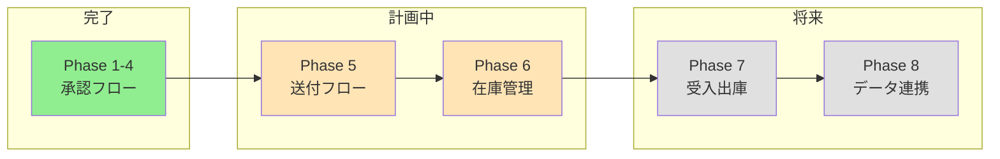

# SharePointリスト化プロジェクト 進捗まとめ

**最終更新**: 2026年1月21日 18:04  
**次回アクション**: Phase6の質問に回答 → 実装開始

---

## 全体進捗

---

## Phase別ステータス

| Phase | 内容 | ステータス | 計画書 |
|-------|------|-----------|--------|
| 1-4 | 購買申請・承認フロー | ✅ 運用中 | - |
| 5 | 承認後送付フロー | 📝 計画確定 | [Phase5_送付フロー計画書.md](file:///C:/Users/%E5%8D%83%E8%B3%80%E8%81%A1%E5%BF%97/OneDrive%20-%20%E3%82%BB%E3%83%AB%E3%82%B8%E3%82%A7%E3%83%B3%E3%83%86%E3%83%83%E3%82%AF%E6%A0%AA%E5%BC%8F%E4%BC%9A%E7%A4%BE/sharepoint%E3%83%AA%E3%82%B9%E3%83%88%E5%8C%96/Documents/Phase5_%E9%80%81%E4%BB%98%E3%83%95%E3%83%AD%E3%83%BC%E8%A8%88%E7%94%BB%E6%9B%B8.md) |
| **6** | **在庫管理リスト** | **🚀 実装開始** | [Phase6_在庫管理リスト計画書.md](file:///C:/Users/%E5%8D%83%E8%B3%80%E8%81%A1%E5%BF%97/OneDrive%20-%20%E3%82%BB%E3%83%AB%E3%82%B8%E3%82%A7%E3%83%B3%E3%83%86%E3%83%83%E3%82%AF%E6%A0%AA%E5%BC%8F%E4%BC%9A%E7%A4%BE/sharepoint%E3%83%AA%E3%82%B9%E3%83%88%E5%8C%96/Documents/Phase6_%E5%9C%A8%E5%BA%AB%E7%AE%A1%E7%90%86%E3%83%AA%E3%82%B9%E3%83%88%E8%A8%88%E7%94%BB%E6%9B%B8.md) |
| 7 | 受入・出庫記録 | 📋 Phase6後 | [Phase7_受入出庫記録計画書.md](file:///C:/Users/%E5%8D%83%E8%B3%80%E8%81%A1%E5%BF%97/OneDrive%20-%20%E3%82%BB%E3%83%AB%E3%82%B8%E3%82%A7%E3%83%B3%E3%83%86%E3%83%83%E3%82%AF%E6%A0%AA%E5%BC%8F%E4%BC%9A%E7%A4%BE/sharepoint%E3%83%AA%E3%82%B9%E3%83%88%E5%8C%96/Documents/Phase7_%E5%8F%97%E5%85%A5%E5%87%BA%E5%BA%AB%E8%A8%98%E9%8C%B2%E8%A8%88%E7%94%BB%E6%9B%B8.md) |
| 8 | 大量データ連携 | 📋 将来対応 | [Phase8_大量データ連携計画書.md](file:///C:/Users/%E5%8D%83%E8%B3%80%E8%81%A1%E5%BF%97/OneDrive%20-%20%E3%82%BB%E3%83%AB%E3%82%B8%E3%82%A7%E3%83%B3%E3%83%86%E3%83%83%E3%82%AF%E6%A0%AA%E5%BC%8F%E4%BC%9A%E7%A4%BE/sharepoint%E3%83%AA%E3%82%B9%E3%83%88%E5%8C%96/Documents/Phase8_%E5%A4%A7%E9%87%8F%E3%83%87%E3%83%BC%E3%82%BF%E9%80%A3%E6%90%BA%E8%A8%88%E7%94%BB%E6%9B%B8.md) |

---

## 関連ファイル

| ファイル | 説明 |
|---------|------|
| 物品管理リストひな形.xlsx | 移行元Excel（17シート） |
| 業者連絡先yymmdd.csv | 業者マスタ |

---

## 次回の会話開始時

「進捗まとめを見て、Phase6を続けて」と伝えてください。
