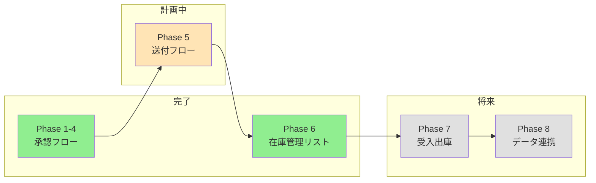

# SharePointリスト化プロジェクト 進捗まとめ

**最終更新**: 2026年1月23日 13:48  
**次回アクション**: 連携テスト実施 → 本番運用開始

---

## 全体進捗

---

## Phase別ステータス

| Phase | 内容 | ステータス | 計画書 |
|-------|------|-----------|--------|
| 1-4 | 購買申請・承認フロー | ✅ 運用中 | - |
| 5 | 承認後送付フロー | 📝 計画確定 | [Phase5_送付フロー計画書.md](Phase5_送付フロー計画書.md) |
| **6** | **在庫管理リスト** | **✅ リスト作成完了** | [Phase6_在庫管理リスト計画書.md](Phase6_在庫管理リスト計画書.md) |
| 7 | 受入・出庫記録 | 📝 手順書完了 | [Phase7_受入出庫記録計画書.md](Phase7_受入出庫記録計画書.md) |
| 8 | 大量データ連携 | 📋 将来対応 | [Phase8_大量データ連携計画書.md](Phase8_大量データ連携計画書.md) |

---

## Phase 6 詳細進捗

| ステップ | 状態 | 備考 |
|---------|:----:|------|
| Step 1: リスト作成 | ✅ | 20列の在庫管理リスト作成済み |
| Step 2: サンプルデータ移行 | ✅ | 13件のテストデータ投入済み |
| Step 3: ビュー設定 | ✅ | ビュー設定ガイド作成済み |
| Step 4: 発注申請フローとの連携 | ✅ | 連携テスト手順書作成済み |
| Step 5: 本番データ移行 | 📋 | 既存Excel確認中 |
| Step 6: 動作確認 | 📋 | 連携テスト実施予定 |

### 作成済みの列（20列）

タイトル(品名)、メーカー、メーカーコード、枝番、包装形状、入数/箱、発注業者、発注ID、単価、現在在庫数、発注者、使用期限、ロット番号、納品日、受入検査日、COA入手日、バーコード、備考、保管場所、保管温度、在庫金額（計算列）

### 計画変更履歴

| 日付 | 変更内容 |
|------|---------|
| 2026/01/23 | 安全在庫数列を削除（運用簡素化のため） |

---

## 関連ファイル

| ファイル | 説明 |
|---------|------|
| 物品管理リストひな形.xlsx | 移行元Excel（17シート） |
| 業者連絡先yymmdd.csv | 業者マスタ |
| 在庫管理.csv | サンプルデータ（13件） |
| 在庫管理リスト_手動作成手順.md | 手動作成手順書 |
| 在庫管理リスト_ビュー設定ガイド.md | ビュー設定ガイド |
| 在庫管理リスト_発注連携テスト手順.md | 連携テスト手順書 |

---

## 次回の会話開始時

「進捗まとめを見て、Phase6の本番データ移行を続けて」
または
「Phase5の送付フローを始めて」
と伝えてください。
