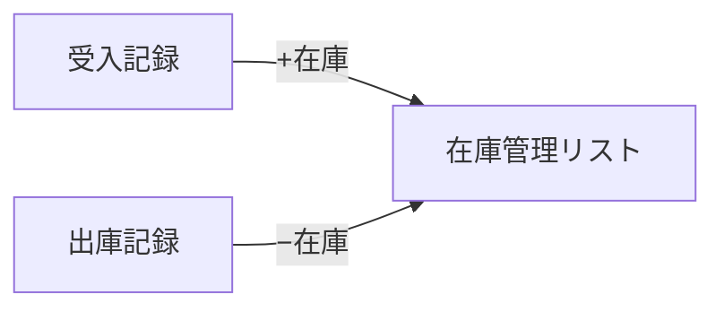
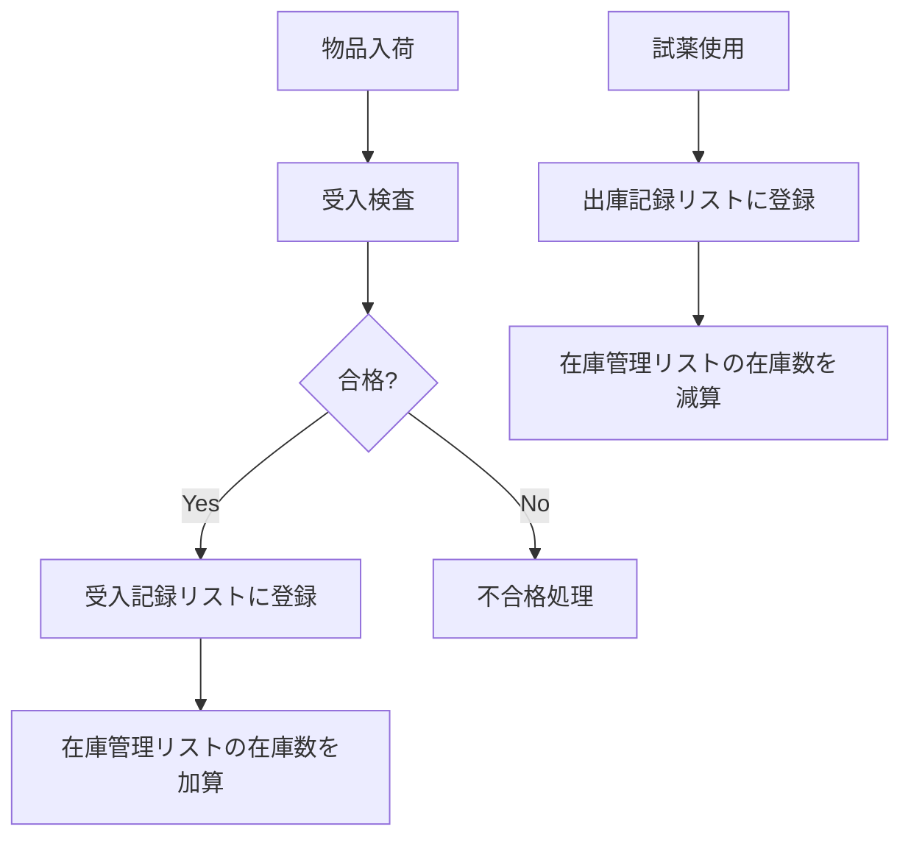

# 受入・出庫記録リスト - 手動作成手順

**対象サイト**: https://cellgentech.sharepoint.com/sites/SP__Prototype  
**作成日**: 2026年1月23日

---

## 概要

在庫管理と連携する受入・出庫記録のためのSharePointリストを作成します。

---

## Part 1: 受入記録リストの作成

### Step 1: リストの作成

1. SharePointサイトを開く
2. ホームページで **「+ 新規」** → **「リスト」** をクリック
3. **「空白のリスト」** を選択
4. 名前に `受入記録` と入力
5. **「作成」** をクリック

---

### Step 2: 列の追加

まず「タイトル」列の名前を変更：
- **「タイトル」** 列のヘッダーをクリック → **「列の設定」** → **「名前の変更」**
- `品名` に変更

以下の列を順番に追加します：

| # | 表示名 | 種類 | 必須 | 備考 |
|---|--------|------|------|------|
| 1 | 受入日 | 日付のみ | ○ | |
| 2 | メーカー | 1行テキスト | ○ | |
| 3 | メーカーコード | 1行テキスト | ○ | |
| 4 | ロット番号 | 1行テキスト | ○ | |
| 5 | 数量 | 数値 | ○ | |
| 6 | 使用期限 | 日付のみ | | |
| 7 | 検査結果 | 選択肢 | ○ | 合格/不合格/保留 |
| 8 | COA確認 | はい/いいえ | | |
| 9 | 担当者 | ユーザー | ○ | |
| 10 | 在庫管理ID | ルックアップ | | 在庫管理リストへのリンク |
| 11 | 備考 | 複数行テキスト | | |

### 検査結果の選択肢設定

1. **「+ 列を追加」** → **「選択肢」**
2. 名前: `検査結果`
3. 選択肢を追加:
   - 合格
   - 不合格
   - 保留
4. 必須: **オン**
5. **「保存」**

### ルックアップ列の設定（在庫管理ID）

1. **「+ 列を追加」** → **「さらに表示」**
2. **「ルックアップ」** を選択
3. 名前: `在庫管理ID`
4. 情報の取得先: `在庫管理`
5. この列内: `タイトル`（品名）
6. **「OK」**

---

## Part 2: 出庫記録リストの作成

### Step 1: リストの作成

1. **「+ 新規」** → **「リスト」** → **「空白のリスト」**
2. 名前: `出庫記録`
3. **「作成」** をクリック

---

### Step 2: 列の追加

「タイトル」を `品名` に変更後、以下を追加：

| # | 表示名 | 種類 | 必須 | 備考 |
|---|--------|------|------|------|
| 1 | 出庫日 | 日付のみ | ○ | |
| 2 | ロット番号 | 1行テキスト | ○ | |
| 3 | 数量 | 数値 | ○ | |
| 4 | 用途 | 選択肢 | | 製造/品管/ICPC/研究/その他 |
| 5 | 使用者 | ユーザー | ○ | |
| 6 | 試験番号 | 1行テキスト | | |
| 7 | 在庫管理ID | ルックアップ | | 在庫管理リストへのリンク |
| 8 | 備考 | 複数行テキスト | | |

### 用途の選択肢設定

1. **「+ 列を追加」** → **「選択肢」**
2. 名前: `用途`
3. 選択肢を追加:
   - 製造
   - 品管
   - ICPC
   - 研究
   - その他
4. **「他の値を選択できるようにする」** を**オン**
5. **「保存」**

---

## Part 3: 在庫管理リストとの連携

### 手動運用（推奨）

**受入時**:
1. 受入記録リストに登録
2. 在庫管理リストの該当品目の「現在在庫数」を加算

**出庫時**:
1. 出庫記録リストに登録
2. 在庫管理リストの該当品目の「現在在庫数」を減算

### 将来の自動連携（オプション）

Power Automateで以下を自動化可能：
- 受入記録登録時 → 在庫+
- 出庫記録登録時 → 在庫−

---

## 確認チェックリスト

### 受入記録リスト
- [ ] リスト「受入記録」が作成できた
- [ ] 検査結果が選択肢になっている
- [ ] 在庫管理リストとルックアップで紐付けできる
- [ ] テストデータを1件登録できた

### 出庫記録リスト
- [ ] リスト「出庫記録」が作成できた
- [ ] 用途が選択肢になっている
- [ ] 在庫管理リストとルックアップで紐付けできる
- [ ] テストデータを1件登録できた

---

## 運用フロー

---

## 関連ドキュメント

- [Phase7_受入出庫記録計画書.md](Phase7_受入出庫記録計画書.md)
- [Phase6_在庫管理リスト計画書.md](Phase6_在庫管理リスト計画書.md)
- [在庫管理リスト_手動作成手順.md](在庫管理リスト_手動作成手順.md)
