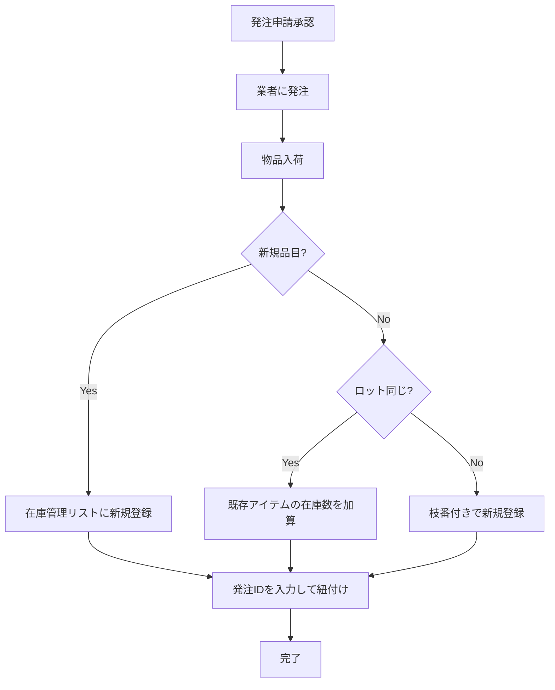

# 在庫管理リスト - 発注申請連携テスト手順

**作成日**: 2026年1月23日  
**対象サイト**: https://cellgentech.sharepoint.com/sites/SP__Prototype

---

## 概要

発注申請リストで承認された品目が入荷した際に、在庫管理リストを更新する運用手順です。

---

## 連携テスト手順

### 前提条件

- [x] 在庫管理リストが作成されている
- [ ] 発注申請リストに承認済みデータがある
- [ ] テスト用の発注ID（例：2601-001-ZC）を決める

---

### Step 1: 発注申請リストの確認

1. SharePointサイトを開く
2. **「発注申請」** リストを開く
3. 承認済み（ステータス = 「承認」）のアイテムを1件選択
4. 以下の情報をメモ：
   - 発注ID（YYDD-000-PJ形式）
   - 品名
   - メーカー
   - メーカーコード
   - 単価
   - 数量
   - 発注者

---

### Step 2: 在庫管理リストへの登録

1. **「在庫管理」** リストを開く
2. **「+ 新規」** をクリック
3. 発注申請リストからメモした情報を入力：

| 在庫管理リストの列 | 入力内容 |
|-------------------|---------|
| 品名（タイトル） | 発注申請の品名 |
| メーカー | 発注申請のメーカー |
| メーカーコード | 発注申請のメーカーコード |
| 発注業者 | 発注申請の業者 |
| **発注ID** | **発注申請のID（重要！）** |
| 単価 | 発注申請の単価 |
| 現在在庫数 | 入荷した数量 |
| 発注者 | 発注申請の発注者 |
| 納品日 | 実際の入荷日 |
| 保管場所 | 保管先（204, 101等） |
| 保管温度 | 保管温度（4℃, -30℃等） |

4. **「保存」** をクリック

---

### Step 3: 既存在庫への追加（同一品目の入荷時）

既に在庫管理リストにある品目が追加入荷した場合：

**パターンA: ロットが同じ場合**
1. 既存アイテムを開く
2. 「現在在庫数」を更新（加算）
3. 保存

**パターンB: ロットが異なる場合（推奨）**
1. 新規アイテムとして登録
2. 「枝番」に -2, -3 等を付与
3. ロット番号、使用期限を正確に入力

---

### Step 4: 連携確認

以下を確認してテスト完了：

| 確認項目 | チェック |
|---------|:-------:|
| 発注IDで発注申請リストと紐付けできる | [ ] |
| メーカーコードが一致している | [ ] |
| 在庫数が正しく登録されている | [ ] |
| 発注IDでフィルターすると該当アイテムが出る | [ ] |

---

## 運用フロー（本番）

---

## トラブルシューティング

### Q: 発注IDを忘れた/わからない

**A**: 発注申請リストで「品名」と「発注日」でフィルターして検索

### Q: 同じ品目が複数ある

**A**: メーカーコードと発注日で特定。必要に応じて枝番で管理

### Q: 在庫金額が表示されない

**A**: 「単価」と「現在在庫数」が入力されているか確認。計算列は自動計算

---

## チェックリスト

- [ ] テストデータで連携の流れを確認した
- [ ] 発注IDでの紐付けが機能している
- [ ] 在庫金額が正しく計算されている
- [ ] 運用担当者に手順を共有した

---

## 関連ドキュメント

- [Phase6_在庫管理リスト計画書.md](Phase6_在庫管理リスト計画書.md)
- [在庫管理リスト_手動作成手順.md](在庫管理リスト_手動作成手順.md)
- [在庫管理リスト_ビュー設定ガイド.md](在庫管理リスト_ビュー設定ガイド.md)
