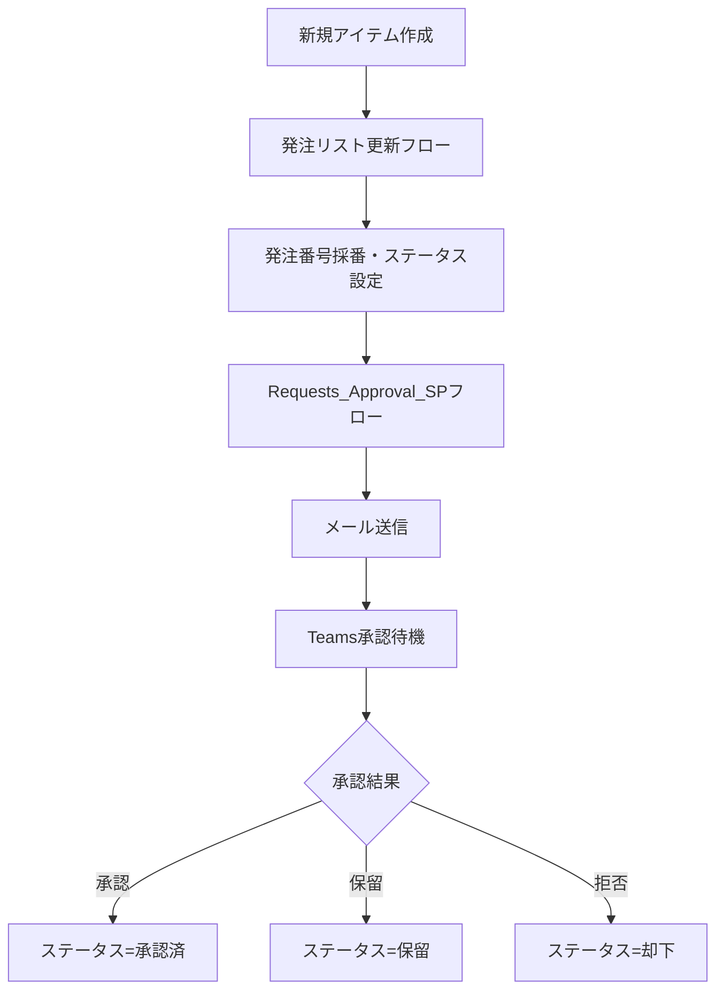

# SharePoint承認フロー 作業引継ぎ（2026/01/20）

**作成日**: 2026年1月20日 11:53  
**次回作業予定**: 未定

---

## 本日完了した作業

### ✅ 1. バージョン管理ルールの変更

**新ルール**:
- **機能追加**: マイナーバージョン（2桁目）を更新（例: 1.0.0.x → 1.1.0.0）
- **バグ修正**: リビジョン（4桁目）を更新（例: 1.1.0.0 → 1.1.0.1）

**ステータス**: ✅ **適用済み**

---

### ✅ 2. プロジェクトフォルダの整理

新しいフォルダ構成を適用しました：

| フォルダ | 内容 |
|----------|------|
| `Release/` | 最新のインポート用パッケージ |
| `Archive/` | 過去の全バージョン |
| `Documents/` | 引継ぎ、マニュアル、設計資料 |
| `Work/` | 開発時の一時フォルダ |

**ステータス**: ✅ **完了**

---

### ⏸️ 3. メール添付ファイル機能（保留）

**目的**: 承認依頼メールにSharePointリストの添付ファイル（見積書PDF等）を含める

**試みた内容**:
1. 正しいoperationIdを調査 → `GetItemAttachments`, `GetAttachmentContent`
2. パラメータ名を調査 → `itemId`, `fileId` など複数試行

**問題点**: 
- JSONファイル編集によるインポートでは、パラメータ名がAPIスキーマと一致せずエラー
- エラーコード: `WorkflowOperationParametersExtraParameter`

**現状**: 
- **添付機能は見送り**
- メール本文にSharePointリンクがあり、そこから添付ファイル確認可能
- 将来的にはPower AutomateのGUIで直接追加することを推奨

**ステータス**: ⏸️ **保留（代替手段あり）**

---

## 関連ファイル

| ファイル | 場所 | 説明 |
|----------|------|------|
| automation_1_1_0_2.zip | `Release/` | **現在使用中（安定版）** |
| automation_1_1_0_0.zip | `Archive/` | v23ベースの最初の新体系版 |
| automation_1_1_0_1.zip | `Archive/` | 添付機能追加試行版（エラー） |
| 引継ぎ_作業まとめ_20260119.md | `Documents/` | 前回の引継ぎ |

---

## 現在の正常動作フロー

---

## 環境情報

| 項目 | 値 |
|------|-----|
| SharePointサイト | https://cellgentech.sharepoint.com/sites/SP__Prototype |
| リストID | 62b6ee4c-05b5-42e3-b9be-fe9fcc1ccdcd |
| リスト名 | 発注依頼_Requests_Test |
| 承認フロー | Requests_Approval_SP (SharePoint承認フロー) |
| 採番フロー | 発注リスト更新 |
| 現在のバージョン | **1.1.0.2** |

---

## 今後の改善提案

1. **添付ファイル機能の再検討**: Power AutomateのGUIで手動追加し、成功したらJSONをエクスポートして正確なパラメータ名を特定
2. フィールド内部名をわかりやすい名前に変更（field_5 → Quantity など）
3. フローのエラーハンドリング強化
